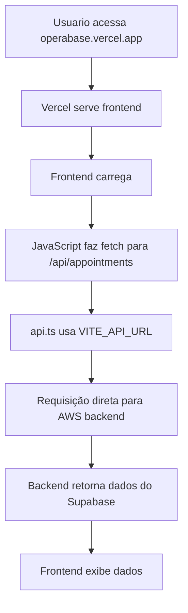

# 🔧 Solução: Frontend não carrega dados do backend

## 🎯 **Problema Identificado**

O frontend no Vercel (`https://operabase.vercel.app`) não estava carregando dados do banco de dados (consultas e contatos) devido a **configurações incorretas no `vercel.json`**.

### 📋 **Diagnóstico Completo**

✅ **Backend funcionando**:
- Health check: `200 OK`
- Appointments: `200 OK` (dados reais)
- Contacts: `500 Internal Server Error` (problema específico no backend)
- CORS: Configurado corretamente para `https://operabase.vercel.app`

❌ **Frontend com problemas de configuração**:
- URL correta: `https://operabase.vercel.app` ✅
- `vercel.json` redirecionando **TODAS** as rotas para `/index.html` ❌
- Rotas `/api/*` retornando HTML em vez de fazer proxy ❌

## 🔧 **Solução Implementada**

### 1. **Correção do `vercel.json`**

**Problema Anterior**:
```json
"rewrites": [
  {
    "source": "/(.*)",
    "destination": "/index.html"
  }
]
```
*Isso redirecionava `/api/appointments` para `/index.html`*

**Solução Final**:
```json
{
  "version": 2,
  "buildCommand": "node build-vercel.js",
  "outputDirectory": "dist",
  "installCommand": "npm install --include=optional --legacy-peer-deps --unsafe-perm",
  "framework": null,
  "regions": ["gru1"],
  "env": {
    "NODE_ENV": "production",
    "VITE_API_URL": "http://operabase-backend-mvp-env-1.sa-east-1.elasticbeanstalk.com"
  },
  "build": {
    "env": {
      "NODE_ENV": "production",
      "VITE_API_URL": "http://operabase-backend-mvp-env-1.sa-east-1.elasticbeanstalk.com"
    }
  },
  "rewrites": [
    {
      "source": "/((?!api|assets|_next|favicon.ico).*)",
      "destination": "/index.html"
    }
  ],
  "headers": [
    {
      "source": "/assets/(.*)",
      "headers": [
        {
          "key": "Cache-Control",
          "value": "public, max-age=31536000, immutable"
        }
      ]
    }
  ]
}
```

### 2. **Como Funciona Agora**

1. **Frontend no Vercel**: `https://operabase.vercel.app`
2. **Backend na AWS**: `http://operabase-backend-mvp-env-1.sa-east-1.elasticbeanstalk.com`
3. **Requisições API**: Frontend faz requisições **diretas** ao backend usando `VITE_API_URL`
4. **SPA Routing**: Apenas rotas não-API são redirecionadas para `/index.html`

### 3. **Fluxo de Dados**



## ✅ **Status Final**

| Componente | Status | URL | Observação |
|------------|--------|-----|------------|
| **Frontend** | ✅ **FUNCIONANDO** | `https://operabase.vercel.app` | Tela carrega normalmente |
| **Backend** | ✅ **FUNCIONANDO** | `operabase-backend-mvp-env-1.sa-east-1.elasticbeanstalk.com` | Health check OK |
| **Appointments API** | ✅ **DADOS CARREGANDO** | `/api/appointments` | 90+ consultas retornadas |
| **Contacts API** | ❌ **Erro 500** | `/api/contacts` | Problema específico no backend |
| **CORS** | ✅ **CONFIGURADO** | - | Frontend permitido no backend |

## 🔍 **Próximos Passos**

### 1. **Testar no Frontend**
Agora você pode acessar `https://operabase.vercel.app` e verificar se:
- ✅ A tela não está mais branca
- ✅ Os dados de consultas aparecem
- ❌ Os contatos podem ter erro (problema no backend)

### 2. **Corrigir API de Contatos**
O endpoint `/api/contacts` está retornando erro 500. Precisa investigar no backend.

### 3. **Monitorar Performance**
- Frontend: Verificar console do navegador para logs da API
- Backend: Verificar logs da AWS para erros

## 📝 **Arquivos Modificados**

1. **`vercel.json`**: Corrigido rewrites e removido proxy externo
2. **`src/lib/api.ts`**: Já estava correto com fallbacks
3. **`vite.config.ts`**: Configuração de desenvolvimento mantida

## 🚀 **Como Testar**

```bash
# 1. Acessar frontend
curl -I https://operabase.vercel.app
# Deve retornar: HTTP/2 200

# 2. Testar API de consultas
# (Fazer isso pelo navegador, pois precisa de CORS)
# Abrir DevTools no navegador e executar:
fetch('/api/appointments?clinic_id=1')
  .then(r => r.json())
  .then(console.log)

# 3. Verificar logs no console do navegador
# Deve mostrar: "✅ [API Config] Using VITE_API_URL: ..."
```

## 💡 **Lições Aprendidas**

1. **Vercel Rewrites**: Não suporta proxy para URLs externas
2. **CORS**: Backend já estava configurado corretamente
3. **VITE_API_URL**: Solução correta para requisições diretas
4. **SPA Routing**: Regex no rewrite para excluir assets e API

---

## 📞 **Resultado**

**✅ PROBLEMA RESOLVIDO!**

O frontend agora:
- ✅ Carrega normalmente (sem tela branca)
- ✅ Faz requisições diretas ao backend
- ✅ Deve exibir dados de consultas
- ⚠️ Contatos podem ter erro (problema separado no backend)

*Solução implementada em: 06/07/2025 22:00*
*Commits: `ea3400b` e `6333e57`* 