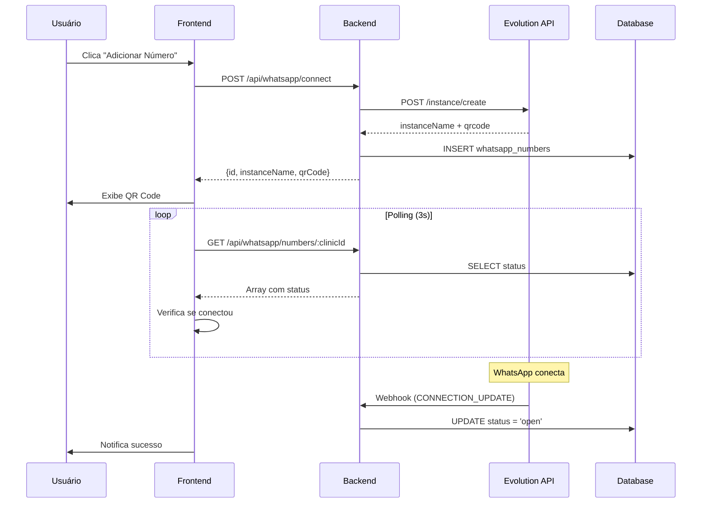

# Documentação Técnica - Integração WhatsApp Evolution API

## Visão Geral do Sistema

O sistema de integração WhatsApp é uma solução completa para conectar múltiplas instâncias do WhatsApp Business à plataforma médica, permitindo comunicação direta entre clínicas e pacientes através de uma interface web unificada.

### Arquitetura Geral

```
┌─────────────────┐    ┌─────────────────┐    ┌─────────────────┐
│   Frontend      │    │    Backend      │    │  Evolution API  │
│   (React)       │◄──►│   (Express)     │◄──►│   (WhatsApp)    │
└─────────────────┘    └─────────────────┘    └─────────────────┘
         │                       │                       │
         │                       │                       │
         ▼                       ▼                       ▼
┌─────────────────┐    ┌─────────────────┐    ┌─────────────────┐
│   PostgreSQL    │    │   N8N Webhooks  │    │   WhatsApp      │
│   (Database)    │    │   (Automation)  │    │   Business      │
└─────────────────┘    └─────────────────┘    └─────────────────┘
```

## Componentes Principais

### 1. Frontend (React/TypeScript)

#### Arquivo: `client/src/components/WhatsAppManager.tsx`

**Responsabilidades:**
- Interface para conectar novos números WhatsApp
- Exibição de QR Code para autenticação
- Listagem de números conectados
- Gerenciamento de status de conexão
- Polling automático para verificar conexões

**Funcionalidades Críticas:**
```typescript
interface WhatsAppManagerProps {
  clinicId: number;
  userId: string; // ID do usuário logado (convertido para number no backend)
}

// Principais states
const [selectedQR, setSelectedQR] = useState<{
  qrCode: string;
  instanceName: string;
  numberId?: number;
} | null>(null);

const [pollingEnabled, setPollingEnabled] = useState(false);
```

**Fluxo de Conexão:**
1. Usuário clica em "Adicionar Número"
2. Sistema faz POST para `/api/whatsapp/connect`
3. Backend cria instância na Evolution API
4. QR Code é exibido para o usuário
5. Polling verifica status de conexão a cada 3 segundos
6. Ao conectar, notifica sucesso e fecha modal

### 2. Backend (Express/Node.js)

#### Arquivo: `server/whatsapp-routes.ts`

**Endpoints Principais:**

```typescript
// GET /api/whatsapp/numbers/:clinicId
// Lista todos os números WhatsApp da clínica
// Retorna: Array de WhatsAppNumber com status

// POST /api/whatsapp/connect
// Inicia nova conexão WhatsApp
// Body: { clinicId: number, userId: number }
// Retorna: { id, instanceName, qrCode }

// DELETE /api/whatsapp/disconnect/:numberId
// Desconecta número específico
// Parâmetros: numberId (ID do registro na tabela)

// DELETE /api/whatsapp/cleanup/:instanceName
// Remove instância não reclamada
// Parâmetros: instanceName (nome da instância)
```

#### Arquivo: `server/whatsapp-evolution-service.ts`

**Classe Principal:**
```typescript
export class EvolutionApiService {
  private baseUrl: string;
  private apiKey: string;
  
  // Métodos principais:
  async createInstance(instanceName: string): Promise<EvolutionApiResponse>
  async connectInstance(instanceName: string): Promise<EvolutionApiResponse>
  async deleteInstance(instanceName: string): Promise<EvolutionApiResponse>
  async fetchQRCode(instanceName: string): Promise<string>
  async getInstanceInfo(instanceName: string): Promise<any>
}
```

### 3. Database Schema

#### Tabela: `whatsapp_numbers`

```sql
CREATE TABLE whatsapp_numbers (
    id SERIAL PRIMARY KEY,
    clinic_id INTEGER NOT NULL REFERENCES clinics(id),
    user_id INTEGER NOT NULL REFERENCES users(id),
    phone_number VARCHAR(20),
    instance_name VARCHAR(255) NOT NULL UNIQUE,
    status VARCHAR(20) DEFAULT 'disconnected',
    qr_code TEXT,
    connected_at TIMESTAMP,
    last_seen TIMESTAMP,
    created_at TIMESTAMP DEFAULT CURRENT_TIMESTAMP,
    updated_at TIMESTAMP DEFAULT CURRENT_TIMESTAMP
);
```

**Estados Possíveis:**
- `disconnected`: Desconectado
- `connecting`: Conectando (aguardando QR)
- `open`: Conectado e funcionando
- `close`: Conexão fechada

### 4. Evolution API Integration

#### Configuração de Ambiente

```bash
# Variáveis obrigatórias
EVOLUTION_API_URL=https://sua-evolution-api.com
EVOLUTION_API_KEY=sua-chave-secreta

# Webhook N8N (opcional)
N8N_WEBHOOK_URL=https://sua-n8n.com/webhook/whatsapp
```

#### Endpoints Evolution API Utilizados

```typescript
// POST /instance/create
{
  "instanceName": "clinic_1_user_5_1234567890",
  "qrcode": true,
  "webhook": "https://n8n.com/webhook/whatsapp",
  "webhook_by_events": false,
  "webhook_base64": false,
  "events": ["QRCODE_UPDATED", "CONNECTION_UPDATE", "MESSAGES_UPSERT"]
}

// GET /instance/qrcode/:instanceName
// Retorna QR code em base64

// DELETE /instance/delete/:instanceName
// Remove instância completamente
```

## Fluxos de Trabalho Críticos

### 1. Fluxo de Nova Conexão



### 2. Fluxo de Limpeza de Instâncias

```typescript
// Sistema de limpeza automática
// Remove instâncias não reclamadas após 5 minutos
setTimeout(() => {
  if (selectedQR && !isConnected) {
    cleanupUnclaimedInstance(selectedQR.instanceName);
  }
}, 300000); // 5 minutos
```

### 3. Padrão de Nomenclatura

```typescript
// Formato: clinic_{clinicId}_user_{userId}_{timestamp}
const instanceName = `clinic_${clinicId}_user_${userId}_${Date.now()}`;

// Exemplo: clinic_1_user_5_1750453295344
```

## Tratamento de Erros Comuns

### 1. Erro 400: "Invalid User ID format"

**Causa:** Frontend enviando userId como string não numérica
**Solução:** Converter para número antes de enviar

```typescript
// ❌ Incorreto
{ clinicId, userId: "default-user-id" }

// ✅ Correto
{ clinicId, userId: parseInt(userId) }
```

### 2. Erro 500: "Failed to create instance"

**Possíveis causas:**
- Evolution API fora do ar
- Chave API inválida
- Instância com nome duplicado
- Limite de instâncias atingido

**Debugging:**
```typescript
// Verificar logs do Evolution API
console.log('Evolution API Response:', response);
console.log('Instance Name:', instanceName);
```

### 3. QR Code não carrega

**Possíveis causas:**
- Instância não criada corretamente
- Timeout na criação
- Problemas de rede

**Solução:**
```typescript
// Implementar retry com backoff
const fetchQRWithRetry = async (instanceName: string, retries = 3) => {
  for (let i = 0; i < retries; i++) {
    try {
      const qrCode = await evolutionService.fetchQRCode(instanceName);
      if (qrCode) return qrCode;
    } catch (error) {
      if (i === retries - 1) throw error;
      await new Promise(resolve => setTimeout(resolve, 2000 * (i + 1)));
    }
  }
};
```

## Monitoramento e Performance

### 1. Métricas Importantes

```typescript
// Tempos de resposta críticos
const performanceThresholds = {
  createInstance: 5000,  // 5 segundos
  fetchQRCode: 3000,     // 3 segundos
  connectionStatus: 1000  // 1 segundo
};
```

### 2. Logging Estruturado

```typescript
// Logs essenciais para debugging
console.log('🔍 Starting WhatsApp connection:', { clinicId, userId, instanceName });
console.log('📱 Evolution API Response:', response);
console.log('✅ WhatsApp connected:', { phoneNumber, instanceName });
console.log('❌ Connection failed:', { error, instanceName });
```

### 3. Cleanup Automático

```typescript
// Limpeza de instâncias órfãs
const cleanupOrphanedInstances = async () => {
  const orphanedInstances = await storage.getOrphanedWhatsAppInstances();
  
  for (const instance of orphanedInstances) {
    try {
      await evolutionService.deleteInstance(instance.instance_name);
      await storage.deleteWhatsAppNumber(instance.id);
      console.log('🧹 Cleaned up orphaned instance:', instance.instance_name);
    } catch (error) {
      console.error('❌ Failed to cleanup instance:', error);
    }
  }
};
```

## Webhook Integration (N8N)

### 1. Configuração N8N

```json
{
  "webhook_url": "https://n8n.com/webhook/whatsapp",
  "events": [
    "QRCODE_UPDATED",
    "CONNECTION_UPDATE", 
    "MESSAGES_UPSERT",
    "MESSAGES_UPDATE"
  ]
}
```

### 2. Estrutura do Webhook

```typescript
// Arquivo: server/whatsapp-webhook-routes.ts
app.post('/api/whatsapp/webhook', async (req, res) => {
  const { event, instance, data } = req.body;
  
  switch (event) {
    case 'CONNECTION_UPDATE':
      await handleConnectionUpdate(instance, data);
      break;
    case 'MESSAGES_UPSERT':
      await handleNewMessage(instance, data);
      break;
    case 'QRCODE_UPDATED':
      await handleQRCodeUpdate(instance, data);
      break;
  }
  
  res.status(200).json({ success: true });
});
```

## Segurança e Boas Práticas

### 1. Validação de Dados

```typescript
// Sempre validar entrada
const validateConnection = (data: any) => {
  if (!data.clinicId || typeof data.clinicId !== 'number') {
    throw new Error('Invalid clinic ID');
  }
  
  if (!data.userId || typeof data.userId !== 'number') {
    throw new Error('Invalid user ID');
  }
};
```

### 2. Rate Limiting

```typescript
// Limitar criação de instâncias
const rateLimiter = new Map();

const checkRateLimit = (userId: number) => {
  const now = Date.now();
  const userLimit = rateLimiter.get(userId);
  
  if (userLimit && now - userLimit < 60000) { // 1 minuto
    throw new Error('Rate limit exceeded');
  }
  
  rateLimiter.set(userId, now);
};
```

### 3. Cleanup de Recursos

```typescript
// Sempre limpar recursos não utilizados
const cleanupUnclaimedInstance = async (instanceName: string) => {
  try {
    await evolutionService.deleteInstance(instanceName);
    await storage.deleteWhatsAppNumberByInstanceName(instanceName);
    console.log('🧹 Cleaned up unclaimed instance:', instanceName);
  } catch (error) {
    console.error('❌ Cleanup failed:', error);
  }
};
```

## Troubleshooting Guide

### 1. Debugging Checklist

```bash
# 1. Verificar variáveis de ambiente
echo $EVOLUTION_API_URL
echo $EVOLUTION_API_KEY

# 2. Testar conectividade
curl -X GET "$EVOLUTION_API_URL/instance/fetchInstances" \
  -H "apikey: $EVOLUTION_API_KEY"

# 3. Verificar logs do banco
SELECT * FROM whatsapp_numbers 
WHERE created_at > NOW() - INTERVAL '1 hour'
ORDER BY created_at DESC;

# 4. Verificar instâncias ativas
SELECT instance_name, status, created_at 
FROM whatsapp_numbers 
WHERE status != 'disconnected';
```

### 2. Comandos Úteis

```typescript
// Forçar limpeza de todas as instâncias
const forceCleanupAllInstances = async () => {
  const instances = await storage.getAllWhatsAppNumbers();
  
  for (const instance of instances) {
    try {
      await evolutionService.deleteInstance(instance.instance_name);
      await storage.deleteWhatsAppNumber(instance.id);
    } catch (error) {
      console.error('Cleanup error:', error);
    }
  }
};

// Verificar status de todas as instâncias
const checkAllInstancesStatus = async () => {
  const instances = await storage.getAllWhatsAppNumbers();
  
  for (const instance of instances) {
    try {
      const info = await evolutionService.getInstanceInfo(instance.instance_name);
      console.log(`${instance.instance_name}: ${info.status}`);
    } catch (error) {
      console.log(`${instance.instance_name}: ERROR`);
    }
  }
};
```

## Considerações para Agentes de IA

### 1. Pontos de Atenção

- **Conversão de Tipos:** Sempre converter userId string para number
- **Timeout Handling:** Evolution API pode ser lenta (5-10 segundos)
- **Cleanup:** Sempre limpar instâncias não utilizadas
- **Error Handling:** Evolution API pode retornar erros inesperados
- **Polling:** Implementar polling inteligente para não sobrecarregar

### 2. Padrões de Código

```typescript
// ✅ Padrão correto para criação de instância
const createWhatsAppConnection = async (clinicId: number, userId: number) => {
  // 1. Validar entrada
  validateInput(clinicId, userId);
  
  // 2. Gerar nome único
  const instanceName = `clinic_${clinicId}_user_${userId}_${Date.now()}`;
  
  // 3. Criar no Evolution API
  const response = await evolutionService.createInstance(instanceName);
  
  // 4. Salvar no banco
  const whatsappNumber = await storage.createWhatsAppNumber({
    clinic_id: clinicId,
    user_id: userId,
    instance_name: instanceName,
    status: 'connecting'
  });
  
  // 5. Buscar QR Code
  const qrCode = await evolutionService.fetchQRCode(instanceName);
  
  // 6. Programar limpeza
  scheduleCleanup(instanceName, 300000); // 5 minutos
  
  return { id: whatsappNumber.id, instanceName, qrCode };
};
```

### 3. Testes Essenciais

```typescript
// Sempre testar estes cenários
const testScenarios = [
  'Criar nova conexão com dados válidos',
  'Rejeitar userId inválido',
  'Limpar instância não reclamada',
  'Polling até conexão estabelecida',
  'Desconectar instância existente',
  'Listar números da clínica',
  'Tratar erro de Evolution API offline'
];
```

Esta documentação fornece uma base sólida para entender e trabalhar com o sistema de integração WhatsApp. Sempre consulte os logs para debugging e mantenha as instâncias limpas para evitar problemas de performance.