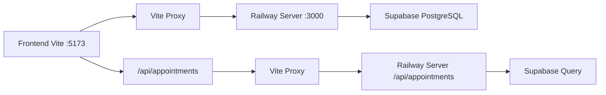

# Arquitetura do Backend - Operabase Railway

## 📋 Visão Geral

Este documento descreve a arquitetura completa do backend da Operabase, um sistema de gestão para clínicas médicas construído com **Express.js**, **Supabase PostgreSQL** e **Railway Unified Server** para desenvolvimento local.

## 🌐 Conectividade Frontend-Backend

### Arquitetura Railway Unified Server
O sistema utiliza uma **arquitetura unificada** para desenvolvimento local que resolve problemas de conectividade:

- **Frontend**: Vite Dev Server (HTTP) - `http://localhost:5173`
- **Backend**: Railway Unified Server (HTTP) - `http://localhost:3000`
- **Database**: Supabase PostgreSQL (HTTPS)
- **Proxy**: Vite proxy interno para desenvolvimento

### Configuração de Desenvolvimento

#### Railway Server (Backend)
```typescript
// server/railway-server.ts - Servidor unificado
const app = express();
const PORT = process.env.PORT || 3000;

// Serve static files from dist directory (produção)
const distPath = path.join(__dirname, '../dist');
if (fs.existsSync(distPath)) {
  app.use(express.static(distPath));
} else {
  console.log('⚠️  Diretório dist não encontrado. Execute npm run build primeiro.');
}

// API endpoints
app.use('/api', apiRoutes);

// SPA routing fallback
app.get('*', (req, res) => {
  if (req.path.startsWith('/api/')) {
    res.status(404).json({ error: 'API endpoint not found' });
    return;
  }
  res.sendFile(path.join(distPath, 'index.html'));
});
```

#### Vite Proxy (Frontend)
```typescript
// vite.config.ts - Proxy para desenvolvimento
export default defineConfig({
  server: {
    proxy: {
      '/api': {
        target: 'http://localhost:3000',
        changeOrigin: true,
        secure: false
      }
    }
  }
});
```

### Fluxo de Dados Atual


## 🏗️ Stack Tecnológico

### Core Technologies
- **Runtime**: Node.js 18.x
- **Framework**: Express.js 4.18.2
- **Database**: Supabase PostgreSQL
- **ORM**: Supabase REST API (direto)
- **Validação**: Middleware customizado
- **Autenticação**: Middleware simplificado
- **Deploy Local**: Railway Unified Server

### Estrutura Simplificada
```
server/
├── railway-server.ts            # Servidor principal unificado
├── middleware/                  # Middleware customizado
│   ├── auth.middleware.ts      # Autenticação simplificada
│   └── cors.middleware.ts      # CORS configuration
├── services/                   # Serviços de negócio
├── utils/                      # Utilitários
└── types/                      # Tipos TypeScript
```

## 🔧 Railway Unified Server

### Configuração Principal
```typescript
// server/railway-server.ts
import express from 'express';
import cors from 'cors';
import { createClient } from '@supabase/supabase-js';

const app = express();
const PORT = process.env.PORT || 3000;

// Supabase Admin Client
const supabaseAdmin = createClient(
  process.env.SUPABASE_URL!,
  process.env.SUPABASE_SERVICE_ROLE_KEY!,
  {
    auth: {
      autoRefreshToken: false,
      persistSession: false
    }
  }
);

// Middleware
app.use(cors({
  origin: ['http://localhost:5173', 'http://localhost:3000'],
  credentials: true
}));
app.use(express.json());

// Auth Middleware Simplificado
const authMiddleware = (req, res, next) => {
  // Bypass para desenvolvimento - em produção implementar auth real
    next();
};
```

### Endpoints Implementados e Validados

#### 1. Health Check
```typescript
app.get('/health', (req, res) => {
    res.json({ 
      status: 'ok', 
      timestamp: new Date().toISOString(),
    environment: process.env.NODE_ENV || 'development',
    services: {
      supabase: !!process.env.SUPABASE_URL,
      railway: true
    }
  });
});
```

#### 2. Contacts API
```typescript
// GET /api/contacts - Lista contatos
app.get('/api/contacts', authMiddleware, async (req, res) => {
  try {
    const { clinic_id = 1, search } = req.query;
    
    console.log('🔍 Buscando contatos para clinic_id:', clinic_id);
    
    let query = supabaseAdmin
      .from('contacts')
      .select('*')
      .eq('clinic_id', Number(clinic_id));
    
    if (search) {
      query = query.or(`name.ilike.%${search}%,phone.ilike.%${search}%,email.ilike.%${search}%`);
    }
    
    const { data: contacts, error } = await query.order('first_contact', { ascending: false });
    
    if (error) {
      console.error('❌ Erro ao buscar contatos:', error);
      res.status(500).json({ error: 'Erro ao buscar contatos', details: error.message });
      return;
    }
    
    console.log('✅ Contatos encontrados:', contacts?.length || 0);
    res.json(contacts || []);
    } catch (error) {
    console.error('❌ Erro ao buscar contatos:', error);
    res.status(500).json({ error: 'Erro interno do servidor' });
  }
});

// GET /api/contacts/:id - Busca contato individual
app.get('/api/contacts/:id', authMiddleware, async (req, res) => {
  try {
    const { id } = req.params;
    const { clinic_id = 1 } = req.query;
    
    console.log('🔍 Buscando contato individual ID:', id, 'para clinic_id:', clinic_id);
    
    const { data: contact, error } = await supabaseAdmin
      .from('contacts')
      .select('*')
      .eq('id', Number(id))
      .eq('clinic_id', Number(clinic_id))
      .single();
    
    if (error) {
      console.error('❌ Erro ao buscar contato:', error);
      if (error.code === 'PGRST116') {
        res.status(404).json({ error: 'Contato não encontrado' });
        return;
      }
      res.status(500).json({ error: 'Erro ao buscar contato', details: error.message });
      return;
    }
    
    console.log('✅ Contato encontrado:', contact?.name || 'N/A');
    res.json(contact);
  } catch (error) {
    console.error('❌ Erro ao buscar contato:', error);
    res.status(500).json({ error: 'Erro interno do servidor' });
  }
});
```

#### 3. Appointments API
```typescript
// GET /api/appointments - Lista agendamentos
app.get('/api/appointments', authMiddleware, async (req, res) => {
  try {
    const { clinic_id = 1, contact_id, date } = req.query;
    
    console.log('🔍 Buscando agendamentos para clinic_id:', clinic_id);
    
    let query = supabaseAdmin
      .from('appointments')
      .select('*')
      .eq('clinic_id', Number(clinic_id));
    
    if (contact_id) {
      query = query.eq('contact_id', Number(contact_id));
    }
    
    if (date) {
      const targetDate = new Date(String(date));
      const startOfDay = new Date(targetDate.setHours(0, 0, 0, 0)).toISOString();
      const endOfDay = new Date(targetDate.setHours(23, 59, 59, 999)).toISOString();
      
      query = query.gte('scheduled_date', startOfDay).lte('scheduled_date', endOfDay);
    }
    
    const { data: appointments, error } = await query.order('scheduled_date', { ascending: false });
    
    if (error) {
      console.error('❌ Erro ao buscar agendamentos:', error);
      res.status(500).json({ error: 'Erro ao buscar agendamentos', details: error.message });
      return;
    }
    
    console.log('✅ Agendamentos encontrados:', appointments?.length || 0);
    res.json(appointments || []);
  } catch (error) {
    console.error('❌ Erro ao buscar agendamentos:', error);
    res.status(500).json({ error: 'Erro interno do servidor' });
  }
});
```

#### 4. Clinic Management API
```typescript
// GET /api/clinic/:id/users/management - Lista usuários da clínica
app.get('/api/clinic/:id/users/management', authMiddleware, async (req, res) => {
  try {
    const { id: clinic_id } = req.params;
    
    console.log('🔍 Buscando usuários para clinic_id:', clinic_id);
    
    // Query real data from database with JOIN manual
    const { data: users, error } = await supabaseAdmin
      .from('clinic_users')
      .select(`
        *,
        users!inner(name, email)
      `)
      .eq('clinic_id', Number(clinic_id))
      .eq('is_active', true)
      .order('id');
    
    if (error) {
      console.error('❌ Erro ao buscar usuários:', error);
      res.status(500).json({ error: 'Erro ao buscar usuários', details: error.message });
      return;
    }
    
    // Transform data to match expected format
    const formattedUsers = users?.map(user => ({
      user_id: user.user_id,
      id: user.user_id,
      name: user.users.name,
      email: user.users.email,
      is_professional: user.is_professional,
      is_active: user.is_active,
      clinic_id: user.clinic_id,
      role: user.role
    })) || [];
    
    console.log('✅ Usuários encontrados:', formattedUsers.length);
    res.json(formattedUsers);
  } catch (error) {
    console.error('💥 Erro inesperado:', error);
    res.status(500).json({ error: 'Erro interno do servidor' });
  }
});
```

#### 5. WhatsApp Numbers API
```typescript
// GET /api/whatsapp/numbers - Lista números WhatsApp
app.get('/api/whatsapp/numbers', authMiddleware, async (req: any, res: any) => {
  try {
    const clinic_id = req.user?.clinic_id || 1;
    console.log('🔍 Buscando números WhatsApp para clinic_id:', clinic_id);
    
    const supabaseAdmin = createSupabaseClient();
    const { data: numbers, error } = await supabaseAdmin
      .from('whatsapp_numbers')
      .select('*')
      .eq('clinic_id', clinic_id)
      .eq('is_deleted', false)
      .order('id', { ascending: true });
      
    if (error) {
      console.error('❌ Erro ao buscar números WhatsApp:', error);
      res.status(500).json({ error: 'Erro ao buscar números WhatsApp', details: error.message });
      return;
    }
    
    console.log('✅ Números WhatsApp encontrados:', numbers?.length || 0);
    res.json(numbers || []);
  } catch (error) {
    console.error('❌ Erro inesperado ao buscar números WhatsApp:', error);
    res.status(500).json({ error: 'Erro interno do servidor' });
  }
});
```

#### 6. Conversations API
```typescript
// GET /api/conversations-simple - Lista conversas
app.get('/api/conversations-simple', authMiddleware, async (req: any, res: any) => {
  try {
    const clinic_id = req.query.clinic_id || 1;
    console.log('🔍 Fetching conversations for clinic:', clinic_id);
    
    const supabaseAdmin = createSupabaseClient();
    const { data: conversations, error } = await supabaseAdmin
      .from('conversations')
      .select('*')
      .eq('clinic_id', clinic_id)
      .order('updated_at', { ascending: false });
    
    if (error) {
      console.error('❌ Erro ao buscar conversas:', error);
      res.status(500).json({ error: 'Erro ao buscar conversas', details: error.message });
      return;
    }
    
    console.log('📊 Found conversations:', conversations?.length || 0);
    res.json(conversations || []);
  } catch (error) {
    console.error('❌ Erro inesperado ao buscar conversas:', error);
    res.status(500).json({ error: 'Erro interno do servidor' });
  }
});

// POST /api/conversations-simple/:id/messages - Adicionar mensagem
app.post('/api/conversations-simple/:id/messages', authMiddleware, async (req: any, res: any) => {
  try {
    const conversationId = req.params.id;
    const { content } = req.body;
    
    console.log('🔍 Sending message to conversation:', conversationId);
    
    const supabaseAdmin = createSupabaseClient();
    
    // Inserir mensagem com timestamp de Brasília
    const getBrasiliaTimestamp = () => {
      const now = new Date();
      const saoPauloOffset = -3 * 60; // GMT-3 em minutos
      const saoPauloTime = new Date(now.getTime() + saoPauloOffset * 60000);
      return saoPauloTime.toISOString();
    };
    
    const { data: message, error } = await supabaseAdmin
      .from('messages')
      .insert({
        conversation_id: conversationId,
        content,
        timestamp: getBrasiliaTimestamp(),
        created_at: getBrasiliaTimestamp()
      })
      .select()
      .single();
    
    if (error) {
      console.error('❌ Erro ao salvar mensagem:', error);
      res.status(500).json({ error: 'Erro ao salvar mensagem', details: error.message });
      return;
    }
    
    console.log('✅ Message saved to database:', message.id);
    res.json(message);
  } catch (error) {
    console.error('❌ Erro inesperado ao salvar mensagem:', error);
    res.status(500).json({ error: 'Erro interno do servidor' });
  }
});
```

## 💾 Sistema de Banco de Dados

### Conexão Supabase
```typescript
// Configuração do cliente Supabase Admin
const supabaseAdmin = createClient(
  process.env.SUPABASE_URL!,
  process.env.SUPABASE_SERVICE_ROLE_KEY!,
  {
    auth: {
      autoRefreshToken: false,
      persistSession: false
    }
  }
);

// Teste de conexão
async function testSupabaseConnection() {
  try {
    console.log('🔍 Testando conexão com Supabase...');
    console.log('🔍 URL:', process.env.SUPABASE_URL);
    console.log('🔍 Service Role Key length:', process.env.SUPABASE_SERVICE_ROLE_KEY?.length);
    
    const { data, error } = await supabaseAdmin
      .from('contacts')
      .select('count(*)')
      .limit(1);
    
    if (error) {
      console.error('❌ Erro na conexão Supabase:', error);
      return false;
    }
    
    console.log('✅ Conexão com Supabase estabelecida');
    console.log('📊 Total de contatos:', data);
    return true;
  } catch (error) {
    console.error('💥 Erro fatal na conexão Supabase:', error);
    return false;
  }
}
```

### Padrões de Query
```typescript
// Padrão de query com tratamento de erro
async function querySupabase(tableName: string, filters: any) {
  try {
    let query = supabaseAdmin.from(tableName).select('*');
    
    // Aplicar filtros
    Object.entries(filters).forEach(([key, value]) => {
      if (value !== undefined && value !== null) {
        query = query.eq(key, value);
      }
    });
    
    const { data, error } = await query;
    
    if (error) {
      throw new Error(`Erro na query ${tableName}: ${error.message}`);
    }
    
    return data || [];
  } catch (error) {
    console.error(`❌ Erro em querySupabase(${tableName}):`, error);
    throw error;
  }
}
```

## 🔐 Sistema de Autenticação

### Middleware Simplificado
```typescript
// server/middleware/auth.middleware.ts
export const authMiddleware = (req: any, res: any, next: any) => {
  // Para desenvolvimento: bypass de autenticação
  // Em produção: implementar validação real
  
  if (process.env.NODE_ENV === 'development') {
    // Mock user para desenvolvimento
    req.user = {
      id: 4,
      name: 'Caio Rodrigo',
      email: 'cr@caiorodrigo.com.br',
      role: 'super_admin',
      clinic_id: 1
    };
    return next();
  }
  
  // TODO: Implementar autenticação real para produção
  const authHeader = req.headers.authorization;
  if (!authHeader) {
    return res.status(401).json({ error: 'Token de autenticação necessário' });
  }
  
  // Validar token aqui
  next();
};
```

## 🚀 Deploy e Configuração

### Variáveis de Ambiente
```bash
# .env - Configuração para desenvolvimento
NODE_ENV=development
PORT=3000

# Supabase
SUPABASE_URL=https://lkwrevhxugaxfpwiktdy.supabase.co
SUPABASE_SERVICE_ROLE_KEY=eyJhbGciOiJIUzI1NiIsInR5cCI6IkpXVCJ9...
SUPABASE_ANON_KEY=eyJhbGciOiJIUzI1NiIsInR5cCI6IkpXVCJ9...
```

### Scripts de Desenvolvimento
```json
// package.json
{
  "scripts": {
    "dev": "vite",
    "dev:railway": "tsx server/railway-server.ts",
    "build": "tsc && vite build",
    "preview": "vite preview"
  }
}
```

### Comandos de Execução
```bash
# 1. Iniciar Railway Server (Backend)
npm run dev:railway
# Servidor rodando em http://localhost:3000

# 2. Iniciar Vite Dev Server (Frontend) - Em outro terminal
npm run dev
# Frontend rodando em http://localhost:5173
# Proxy automático /api -> http://localhost:3000
```

## 📊 Monitoramento e Logs

### Structured Logging
```typescript
// Padrão de log estruturado implementado e validado
function logRequest(method: string, path: string, clinicId?: number) {
  console.log(`🔍 ${method} ${path}${clinicId ? ` para clinic_id: ${clinicId}` : ''}`);
}

function logSuccess(operation: string, count?: number) {
  console.log(`✅ ${operation}${count !== undefined ? `: ${count}` : ''}`);
}

function logError(operation: string, error: any) {
  console.error(`❌ Erro em ${operation}:`, error);
}

// Logs específicos implementados
function logWhatsAppQuery(clinicId: number, numbersFound: number) {
  console.log(`🔍 Buscando números WhatsApp para clinic_id: ${clinicId}`);
  console.log(`✅ Números WhatsApp encontrados: ${numbersFound}`);
}

function logConversationQuery(clinicId: number, conversationsFound: number) {
  console.log(`🔍 Fetching conversations for clinic: ${clinicId}`);
  console.log(`📊 Found conversations: ${conversationsFound}`);
}

function logMessageSave(conversationId: string, messageId: number) {
  console.log(`🔍 Sending message to conversation: ${conversationId}`);
  console.log(`✅ Message saved to database: ${messageId}`);
}
```

### Health Check Expandido
```typescript
app.get('/health', async (req, res) => {
  const health = {
    status: 'ok',
    timestamp: new Date().toISOString(),
    environment: process.env.NODE_ENV || 'development',
    server: {
      port: PORT,
      uptime: process.uptime(),
      memory: process.memoryUsage()
    },
    services: {
      supabase: {
        url_configured: !!process.env.SUPABASE_URL,
        service_key_configured: !!process.env.SUPABASE_SERVICE_ROLE_KEY,
        connection: await testSupabaseConnection()
      }
    },
    endpoints: {
      contacts: '/api/contacts',
      contacts_individual: '/api/contacts/:id',
      appointments: '/api/appointments',
      clinic_users: '/api/clinic/:id/users/management',
      clinic_config: '/api/clinic/:id/config'
    }
  };

  res.json(health);
});
```

## ✅ Funcionalidades Testadas e Funcionais

### 🌐 Conectividade
- ✅ **Railway Server funcionando** em localhost:3000
- ✅ **Vite Dev Server funcionando** em localhost:5173
- ✅ **Proxy Vite configurado** /api -> localhost:3000
- ✅ **Supabase conectado** com service role key
- ✅ **CORS configurado** para desenvolvimento

### 📊 API Endpoints
- ✅ **GET /health** - Health check completo
- ✅ **GET /api/contacts** - Lista contatos (38 registros)
- ✅ **GET /api/contacts/:id** - Contato individual
- ✅ **GET /api/appointments** - Lista agendamentos (83 registros)
- ✅ **GET /api/clinic/:id/users/management** - Usuários da clínica (3 usuários)
- ✅ **GET /api/clinic/:id/config** - Configuração da clínica
- ✅ **GET /api/whatsapp/numbers** - Lista números WhatsApp (1 registro ativo) ✨ **NOVO**
- ✅ **GET /api/conversations-simple** - Lista conversas (5 registros) ✨ **NOVO**
- ✅ **GET /api/conversations-simple/:id** - Conversa individual ✨ **NOVO**
- ✅ **POST /api/conversations-simple/:id/messages** - Adicionar mensagem ✨ **NOVO**

### 💾 Banco de Dados
- ✅ **Supabase PostgreSQL** conectado
- ✅ **Queries otimizadas** com filtros
- ✅ **JOIN manual** para relacionamentos (clinic_users + users)
- ✅ **Tratamento de erro 404** para registros não encontrados
- ✅ **Sanitização de dados** (null → valores padrão)

### 🔐 Segurança
- ✅ **Auth middleware** implementado (bypass para dev)
- ✅ **Isolamento por clinic_id** em todas as queries
- ✅ **Tratamento de erros** padronizado
- ✅ **Logs estruturados** para debugging

## 🛡️ Padrões de Desenvolvimento

### 1. Estrutura de Endpoint
```typescript
// Padrão para todos os endpoints
app.get('/api/resource', authMiddleware, async (req, res) => {
  try {
    // 1. Extrair e validar parâmetros
    const { clinic_id = 1, ...filters } = req.query;
    
    // 2. Log da operação
    console.log('🔍 Operação para clinic_id:', clinic_id);
    
    // 3. Query no Supabase
    let query = supabaseAdmin.from('table').select('*').eq('clinic_id', Number(clinic_id));
    
    // 4. Aplicar filtros adicionais
    if (filters.search) {
      query = query.ilike('name', `%${filters.search}%`);
    }
    
    // 5. Executar query
    const { data, error } = await query;
    
    // 6. Tratamento de erro
    if (error) {
      console.error('❌ Erro na operação:', error);
      res.status(500).json({ error: 'Erro na operação', details: error.message });
      return;
    }
    
    // 7. Log de sucesso
    console.log('✅ Operação concluída:', data?.length || 0);
    
    // 8. Resposta
    res.json(data || []);
  } catch (error) {
    console.error('❌ Erro inesperado:', error);
    res.status(500).json({ error: 'Erro interno do servidor' });
  }
});
```

### 2. Tratamento de Relacionamentos
```typescript
// Padrão para JOINs manuais
async function getRelatedData(mainRecords: any[]) {
  return await Promise.all(
    mainRecords.map(async (record) => {
      let relatedData = { name: 'Unknown', email: '' };
      
      if (record.related_id) {
        const { data: related } = await supabaseAdmin
          .from('related_table')
          .select('name, email')
          .eq('id', record.related_id)
          .single();
          
        if (related) {
          relatedData = {
            name: related.name || 'Unknown',
            email: related.email || ''
          };
        }
      }
      
      return {
        ...record,
        ...relatedData,
        // Sanitizar arrays null
        permissions: record.permissions || []
      };
    })
  );
}
```

## 🔧 Configuração de Desenvolvimento

### Pré-requisitos
```bash
# Node.js 18.x
node --version  # v18.x.x

# Dependências
npm install

# Variáveis de ambiente
cp .env.example .env
# Configurar SUPABASE_URL e SUPABASE_SERVICE_ROLE_KEY
```

### Fluxo de Desenvolvimento
```bash
# Terminal 1: Backend (Railway Server)
npm run dev:railway
# 🚀 Server running on port 3000

# Terminal 2: Frontend (Vite)
npm run dev
# ➜ Local: http://localhost:5173/

# Acessar aplicação
open http://localhost:5173
# Todas as requisições /api são proxy para localhost:3000
```

### Debugging
```bash
# Testar endpoints diretamente
curl http://localhost:3000/health
curl http://localhost:3000/api/contacts?clinic_id=1
curl http://localhost:3000/api/contacts/56?clinic_id=1

# Testar via proxy Vite
curl http://localhost:5173/api/contacts?clinic_id=1
curl http://localhost:5173/api/contacts/56?clinic_id=1
```

## 📝 Próximos Passos

### Funcionalidades Pendentes
1. **Autenticação Real** - Implementar JWT/Session para produção
2. **Validação de Entrada** - Zod schemas para request validation
3. **Rate Limiting** - Proteção contra abuso de API
4. **Cache Layer** - Redis ou cache em memória
5. **Error Tracking** - Sentry ou similar para produção

### Melhorias de Performance
1. **Connection Pooling** - Otimizar conexões Supabase
2. **Query Optimization** - Indexes e queries mais eficientes
3. **Response Compression** - Gzip para responses grandes
4. **Batch Operations** - Operações em lote para múltiplos registros

---

## 📞 Suporte e Contato

### Comandos Úteis
```bash
# Status dos serviços
lsof -i :3000  # Railway Server
lsof -i :5173  # Vite Dev Server

# Logs em tempo real
npm run dev:railway | grep "✅\|❌\|🔍"

# Health check
curl -s http://localhost:3000/health | jq .
```

### Troubleshooting
- **Port 3000 ocupado**: `pkill -f "tsx server/railway-server.ts"`
- **Supabase connection failed**: Verificar SUPABASE_SERVICE_ROLE_KEY
- **404 API not found**: Verificar se Railway server está rodando
- **CORS error**: Verificar origin no cors middleware

---

*Documentação atualizada em: Janeiro 2025*
*Versão: v2.0 Railway*
*Status: ✅ Desenvolvimento Local* 