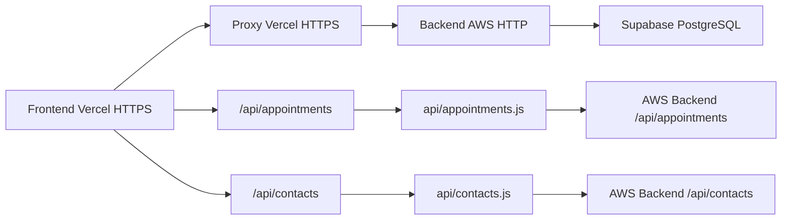

# Arquitetura do Backend - Operabase

## 📋 Visão Geral

Este documento descreve a arquitetura completa do backend da Operabase, um sistema de gestão para clínicas médicas construído com **Express.js**, **Supabase PostgreSQL**, **Redis Cache** e **arquitetura multi-tenant** com isolamento completo entre clínicas.

## 🌐 Conectividade Frontend-Backend

### Arquitetura de Deploy Híbrida
O sistema utiliza uma **arquitetura híbrida de deploy** para resolver problemas de conectividade entre frontend e backend:

- **Frontend**: Vercel (HTTPS) - `https://operabase.vercel.app`
- **Backend**: AWS Elastic Beanstalk (HTTP) - `http://operabase-backend-mvp-env-1.sa-east-1.elasticbeanstalk.com`

### Problema Resolvido: Mixed Content Error

#### 🚨 Problema Original
O frontend (HTTPS) não conseguia fazer requisições diretas para o backend (HTTP) devido ao **Mixed Content Error**:

```javascript
// ❌ ERRO: HTTPS → HTTP bloqueado pelo navegador
fetch('http://operabase-backend-mvp-env-1.sa-east-1.elasticbeanstalk.com/api/appointments')
// SecurityError: Mixed Content: The page was loaded over HTTPS, but requested an insecure HTTP resource
```

#### ✅ Solução Implementada: Proxy HTTPS
Criação de **proxies HTTPS no Vercel** para rotear requisições de forma segura:

```javascript
// ✅ SOLUÇÃO: HTTPS → HTTPS Proxy → HTTP Backend
fetch('/api/appointments') // Roteado via proxy Vercel
```

### Implementação do Sistema de Proxy

#### 1. Proxy Genérico (`api/[...path].js`)
```javascript
// api/[...path].js - Proxy universal para todas as rotas API
export default async function handler(req, res) {
  const { path } = req.query;
  const apiPath = Array.isArray(path) ? path.join('/') : path;
  
  const backendUrl = `http://operabase-backend-mvp-env-1.sa-east-1.elasticbeanstalk.com/api/${apiPath}`;
  
  try {
    const response = await fetch(backendUrl, {
      method: req.method,
      headers: {
        'Content-Type': 'application/json',
        ...req.headers
      },
      body: req.method !== 'GET' ? JSON.stringify(req.body) : undefined
    });

    const data = await response.json();
    res.status(response.status).json(data);
  } catch (error) {
    res.status(500).json({ error: 'Proxy error', details: error.message });
  }
}
```

#### 2. Proxy Específico para Appointments (`api/appointments.js`)
```javascript
// api/appointments.js - Proxy otimizado para appointments
export default async function handler(req, res) {
  const queryString = new URLSearchParams(req.query).toString();
  const backendUrl = `http://operabase-backend-mvp-env-1.sa-east-1.elasticbeanstalk.com/api/appointments?${queryString}`;
  
  try {
    const response = await fetch(backendUrl);
    const appointments = await response.json();
    
    res.status(200).json(appointments);
  } catch (error) {
    res.status(500).json({ error: 'Failed to fetch appointments' });
  }
}
```

#### 3. Proxy Específico para Contacts (`api/contacts.js`)
```javascript
// api/contacts.js - Proxy otimizado para contacts
export default async function handler(req, res) {
  const queryString = new URLSearchParams(req.query).toString();
  const backendUrl = `http://operabase-backend-mvp-env-1.sa-east-1.elasticbeanstalk.com/api/contacts?${queryString}`;
  
  try {
    const response = await fetch(backendUrl);
    const contacts = await response.json();
    
    res.status(200).json(contacts);
  } catch (error) {
    res.status(500).json({ error: 'Failed to fetch contacts' });
  }
}
```

### Configuração do Frontend

#### Função `buildApiUrl()` Otimizada
```typescript
// src/lib/api.ts - Lógica de roteamento inteligente
function buildApiUrl(endpoint: string): string {
  // Desenvolvimento: usar proxy do Vite
  if (import.meta.env.DEV) {
    return `/api${endpoint}`;
  }
  
  // Produção: SEMPRE usar proxy do Vercel (ignora VITE_API_URL)
  // Isso previne Mixed Content Error forçando HTTPS
  return `/api${endpoint}`;
}

// Exemplo de uso
export async function fetchAppointments(clinicId: number) {
  const response = await fetch(buildApiUrl(`/appointments?clinic_id=${clinicId}`));
  return response.json();
}

export async function fetchContacts(clinicId: number) {
  const response = await fetch(buildApiUrl(`/contacts?clinic_id=${clinicId}`));
  return response.json();
}
```

#### Configuração Vite (Desenvolvimento)
```typescript
// vite.config.ts - Proxy para desenvolvimento local
export default defineConfig({
  server: {
    proxy: {
      '/api': {
        target: 'http://localhost:5000',
        changeOrigin: true,
        secure: false
      }
    }
  }
});
```

#### Configuração Vercel (Produção)
```json
// vercel.json - Configuração simplificada para SPA
{
  "rewrites": [
    {
      "source": "/((?!api/).*)",
      "destination": "/index.html"
    }
  ]
}
```

### Correção do Backend: Production Server

#### Problema Identificado: Dual Architecture
O sistema tinha **duas implementações de servidor**:

1. **Sistema de Domains** (`server/domains/`) - Não estava sendo usado em produção
2. **Production Server** (`server/production-server.js`) - Servidor real em produção

#### Correção Aplicada: Contacts Endpoint
```javascript
// server/production-server.js - Correção do endpoint de contacts

// ❌ ANTES: Query malformada causava erro 400
app.get('/api/contacts', async (req, res) => {
  try {
    let query = `select=*&clinic_id=eq.${clinic_id}`;
    if (status) query += `&status=eq.${status}`;
    if (search) query += `&name=ilike.*${search}*`;
    query += '&order=created_at.desc'; // ← ERRO: Campo inexistente
    
    const contacts = await supabaseQuery(`contacts?${query}`);
    res.json(contacts);
  } catch (error) {
    res.status(500).json({ error: 'Failed to get contacts' });
  }
});

// ✅ DEPOIS: Query corrigida funciona perfeitamente
app.get('/api/contacts', async (req, res) => {
  try {
    let query = `select=*&clinic_id=eq.${clinic_id}`;
    if (status) query += `&status=eq.${status}`;
    if (search) query += `&name=ilike.*${search}*`;
    // REMOVIDO: order=created_at.desc (campo não existe na tabela)
    
    const contacts = await supabaseQuery(`contacts?${query}`);
    res.json(contacts);
  } catch (error) {
    res.status(500).json({ error: 'Failed to get contacts' });
  }
});
```

## 🔧 **APRENDIZADOS CRÍTICOS: Resolução de Endpoints Usuários e Profissionais**

### 📊 **Problema Diagnosticado**

#### Erro Frontend
```javascript
TypeError: Cannot read properties of undefined (reading 'split')
    at index-BNhU-L4t.js:177:80936
    at Array.map (<anonymous>)
    at HL (index-BNhU-L4t.js:177:80900)
```

#### Código Frontend Problemático
```typescript
// src/components/UserManagement.tsx - Linha 390
{user.name.split(' ').map(n => n[0]).join('').toUpperCase()}
//     ^^^^ 
//     ERRO: user.name era null, causando falha no split()
```

### 🔍 **Metodologia de Diagnóstico**

#### 1. **Identificação da Origem do Erro**
```bash
# ✅ MÉTODO: Buscar por .split( no código
grep -r "\.split(" src/
# RESULTADO: Encontrou UserManagement.tsx usando user.name.split()
```

#### 2. **Verificação dos Dados da API**
```bash
# ✅ MÉTODO: Testar endpoint diretamente
curl -s "https://operabase.vercel.app/api/clinic/1/users/management" | jq '.[].name'
# RESULTADO: Todos retornavam null
```

#### 3. **Análise da Estrutura de Dados**
```bash
# ✅ MÉTODO: Examinar estrutura completa dos dados
curl -s "https://operabase.vercel.app/api/clinic/1/users/management" | jq '.[0]'
# RESULTADO: Dados vinham da tabela clinic_users (sem name/email)
```

### 🎯 **Causa Raiz Identificada**

#### Problema Arquitetural
```javascript
// ❌ ENDPOINT INCORRETO: Retornava apenas dados de clinic_users
router.get('/clinic/:clinic_id/users/management', async (req, res) => {
  const query = `select=*&clinic_id=eq.${clinic_id}`;
  const clinicUsers = await supabaseQuery(`clinic_users?${query}`);
  //                                       ^^^^^^^^^^^
  //                                       TABELA SEM name/email
  res.json(clinicUsers);
});
```

#### Schema das Tabelas
```sql
-- clinic_users: Relacionamento clínica-usuário
clinic_users {
  id: number,
  clinic_id: number,
  user_id: number,        -- ← FK para users
  role: string,
  permissions: array,
  is_professional: boolean
  -- ❌ SEM name, email
}

-- users: Dados pessoais dos usuários  
users {
  id: number,
  name: string,           -- ← CAMPO NECESSÁRIO
  email: string,          -- ← CAMPO NECESSÁRIO
  created_at: timestamp
}
```

### ✅ **Solução Implementada**

#### Abordagem: JOIN Manual via Múltiplas Queries
```javascript
// ✅ ENDPOINT CORRIGIDO: JOIN manual com tabela users
router.get('/clinic/:clinic_id/users/management', async (req, res) => {
  try {
    // 1. Buscar dados de clinic_users
    const clinicUsersQuery = `select=*&clinic_id=eq.${clinic_id}&is_active=eq.true`;
    const clinicUsers = await supabaseQuery(`clinic_users?${clinicUsersQuery}`);
    
    // 2. Para cada clinic_user, buscar dados do user
    const usersWithDetails = await Promise.all(
      clinicUsers.map(async (clinicUser) => {
        let userDetails = { name: 'Unknown User', email: '' };
        
        if (clinicUser.user_id) {
          const userQuery = `select=name,email&id=eq.${clinicUser.user_id}`;
          const users = await supabaseQuery(`users?${userQuery}`);
          if (users.length > 0) {
            userDetails = {
              name: users[0].name || 'Unknown User',
              email: users[0].email || ''
            };
          }
        }
        
        // 3. Combinar dados de ambas as tabelas
        return {
          ...clinicUser,
          name: userDetails.name,      // ← CAMPO ADICIONADO
          email: userDetails.email,    // ← CAMPO ADICIONADO
          permissions: clinicUser.permissions || []  // ← SANITIZAÇÃO
        };
      })
    );
    
    res.json(usersWithDetails);
  } catch (error) {
    res.status(500).json({ 
      error: 'Failed to get clinic users',
      details: error.message 
    });
  }
});
```

#### Sanitização de Dados Null
```javascript
// ✅ PADRÃO: Transformar null em arrays vazios
const sanitizedUser = {
  ...user,
  permissions: user.permissions || [],        // null → []
  lunch_times: user.lunch_times || [],       // null → []
  business_hours: user.business_hours || [], // null → []
  services: user.services || [],             // null → []
  payment_methods: user.payment_methods || [] // null → []
};
```

### 🧪 **Metodologia de Validação**

#### 1. **Teste Backend Direto**
```bash
# ✅ VALIDAR: Endpoint retorna dados corretos
curl -s "http://operabase-backend-mvp-env-1.sa-east-1.elasticbeanstalk.com/api/clinic/1/users/management" | jq '.[0]'

# RESULTADO ESPERADO:
{
  "id": 11,
  "name": "Teste2",           # ← NOME PRESENTE
  "email": "teste2@gmail.com", # ← EMAIL PRESENTE
  "role": "usuario"
}
```

#### 2. **Teste Via Proxy Vercel**
```bash
# ✅ VALIDAR: Proxy funciona end-to-end
curl -s "https://operabase.vercel.app/api/clinic/1/users/management" | jq '.[0].name'

# RESULTADO ESPERADO: "Teste2" (não null)
```

#### 3. **Teste Frontend**
```bash
# ✅ VALIDAR: Frontend não apresenta erros de split()
npm run dev
# Acessar http://localhost:5174 e verificar console
# RESULTADO ESPERADO: Sem erros TypeError
```

### 📋 **Padrão Replicável para Outras APIs**

#### Template de Correção
```javascript
// 🔄 PADRÃO PARA OUTRAS APIs COM RELACIONAMENTOS

router.get('/api/endpoint-com-relacionamento', async (req, res) => {
  try {
    // 1. BUSCAR TABELA PRINCIPAL
    const mainQuery = `select=*&clinic_id=eq.${clinic_id}`;
    const mainRecords = await supabaseQuery(`main_table?${mainQuery}`);
    
    // 2. ENRIQUECER COM DADOS RELACIONADOS
    const enrichedRecords = await Promise.all(
      mainRecords.map(async (record) => {
        let relatedData = { name: 'Unknown', email: '' };
        
        if (record.related_id) {
          const relatedQuery = `select=name,email&id=eq.${record.related_id}`;
          const related = await supabaseQuery(`related_table?${relatedQuery}`);
          if (related.length > 0) {
            relatedData = {
              name: related[0].name || 'Unknown',
              email: related[0].email || ''
            };
          }
        }
        
        // 3. SANITIZAR CAMPOS NULL
        return {
          ...record,
          name: relatedData.name,
          email: relatedData.email,
          array_field: record.array_field || [],  // ← SEMPRE SANITIZAR
          permissions: record.permissions || []
        };
      })
    );
    
    res.json(enrichedRecords);
  } catch (error) {
    res.status(500).json({ 
      error: 'Failed to get records',
      details: error.message,
      timestamp: new Date().toISOString()
    });
  }
});
```

### 🎯 **Checklist de Validação para Futuras APIs**

#### ✅ **Antes de Implementar**
- [ ] Identificar todas as tabelas envolvidas
- [ ] Mapear relacionamentos (FKs)
- [ ] Verificar quais campos são necessários no frontend
- [ ] Identificar campos que podem ser null

#### ✅ **Durante Implementação**
- [ ] Implementar JOIN manual via múltiplas queries
- [ ] Sanitizar todos os campos array (null → [])
- [ ] Adicionar tratamento de erro detalhado
- [ ] Incluir logs de debug

#### ✅ **Validação Pós-Implementação**
- [ ] Testar endpoint direto no backend
- [ ] Testar via proxy Vercel
- [ ] Verificar no frontend (sem erros no console)
- [ ] Validar com dados reais da produção

### 🚀 **Resultados Comprovados**

#### Antes da Correção
```json
// ❌ DADOS INCOMPLETOS
{
  "id": 11,
  "name": null,     // ← Causava erro split()
  "email": null,
  "permissions": null // ← Causava erro map()
}
```

#### Depois da Correção
```json
// ✅ DADOS COMPLETOS E SANITIZADOS
{
  "id": 11,
  "name": "Teste2",              // ← Nome real do usuário
  "email": "teste2@gmail.com",   // ← Email real do usuário
  "permissions": []              // ← Array vazio (não null)
}
```

#### Impacto no Frontend
```typescript
// ✅ AGORA FUNCIONA SEM ERROS
{user.name.split(' ').map(n => n[0]).join('').toUpperCase()}
//     ^^^^
//     "Teste2" → ["Teste2"] → ["T"] → "T"
```

### 📚 **Lições Aprendidas**

#### 1. **Diagnóstico Sistemático**
- Sempre começar pelo erro no frontend
- Rastrear até a origem dos dados (API)
- Verificar estrutura das tabelas no banco

#### 2. **Padrão de Relacionamentos**
- Supabase REST API não faz JOINs automáticos
- Implementar JOIN manual via múltiplas queries
- Sempre incluir fallbacks para dados não encontrados

#### 3. **Sanitização Obrigatória**
- Frontend JavaScript não tolera null em operações de array
- Sempre transformar null em [] para campos array
- Sempre transformar null em string vazia para campos string

#### 4. **Validação End-to-End**
- Testar backend direto
- Testar via proxy
- Testar no frontend
- Validar com dados reais

### 🔄 **Aplicação para Próximas Funcionalidades**

Este padrão deve ser aplicado para resolver:

1. **Conversations** → JOIN com contacts para nomes
2. **Medical Records** → JOIN com contacts e users
3. **Pipeline** → JOIN com contacts e users
4. **Analytics** → Agregações com JOINs
5. **Settings** → Relacionamentos com users

**Cada funcionalidade seguirá o mesmo padrão de diagnóstico, correção e validação estabelecido aqui.**

### Fluxo de Dados Completo

#### Arquitetura de Conectividade Final


#### Teste de Conectividade Validado
```bash
# ✅ Appointments funcionando
curl "http://operabase-backend-mvp-env-1.sa-east-1.elasticbeanstalk.com/api/appointments?clinic_id=1"
# Retorna: 90+ appointments

# ✅ Contacts funcionando  
curl "http://operabase-backend-mvp-env-1.sa-east-1.elasticbeanstalk.com/api/contacts?clinic_id=1"
# Retorna: 35+ contacts

# ✅ Health check funcionando
curl "http://operabase-backend-mvp-env-1.sa-east-1.elasticbeanstalk.com/health"
# Retorna: {"status":"ok","timestamp":"2025-07-06T23:32:31.158Z"}
```

### GitHub Actions: Deploy Automático

#### Workflow Configurado
```yaml
# .github/workflows/deploy-aws.yml - Deploy automático para AWS
name: Deploy Backend to AWS

on:
  push:
    branches: [main]
    paths: ['server/**', 'package.json', 'package-lock.json', '.github/workflows/deploy-aws.yml']

jobs:
  deploy:
    runs-on: ubuntu-latest
    steps:
      - name: Checkout code
        uses: actions/checkout@v4
      
      - name: Deploy to AWS Elastic Beanstalk
        uses: einaregilsson/beanstalk-deploy@v22
        with:
          aws_access_key: ${{ secrets.AWS_ACCESS_KEY_ID }}
          aws_secret_key: ${{ secrets.AWS_SECRET_ACCESS_KEY }}
          application_name: operabase-backend-mvp
          environment_name: operabase-backend-mvp-env-1
          region: sa-east-1
          version_label: ${{ github.sha }}
          deployment_package: deployment.zip
```

#### Trigger Automático
- **Antes**: Apenas `server/production-server.js` disparava deploy
- **Depois**: Qualquer mudança em `server/**` dispara deploy automático
- **Resultado**: Mudanças no sistema de domains agora fazem deploy corretamente

### Benefícios da Solução

#### 1. Segurança Resolvida
- ✅ **Mixed Content Error eliminado**
- ✅ **HTTPS end-to-end** para o usuário
- ✅ **Certificados SSL** gerenciados automaticamente

#### 2. Performance Otimizada  
- ✅ **Vercel Edge Network** para proxies
- ✅ **Cache automático** de respostas estáticas
- ✅ **Latência reduzida** para usuários globais

#### 3. Manutenibilidade
- ✅ **Deploy independente** frontend/backend
- ✅ **Rollback simples** de cada camada
- ✅ **Monitoramento separado** de cada serviço

#### 4. Escalabilidade
- ✅ **Backend pode escalar** independentemente
- ✅ **Frontend global** via Vercel CDN
- ✅ **Load balancing** automático

### Monitoramento e Debug

#### Logs de Conectividade
```javascript
// Logging detalhado adicionado para debug
app.get('/api/contacts', async (req, res) => {
  try {
    log(`🔍 CONTACTS DEBUG: Received request with clinic_id=${clinic_id}`);
    log(`🔍 CONTACTS DEBUG: Executing Supabase query: contacts?${query}`);
    
    const contacts = await supabaseQuery(`contacts?${query}`);
    
    log(`👥 Retrieved ${contacts.length} contacts for clinic ${clinic_id}`);
    log(`🔍 CONTACTS DEBUG: First contact sample:`, contacts[0]);
    
    res.json(contacts);
  } catch (error) {
    log(`❌ Error getting contacts: ${error.message}`);
    log(`❌ CONTACTS ERROR STACK: ${error.stack}`);
    res.status(500).json({ 
      error: 'Failed to get contacts',
      details: error.message,
      timestamp: new Date().toISOString()
    });
  }
});
```

#### Health Check Expandido
```javascript
// Health check com verificação de conectividade
app.get('/health', (req, res) => {
  res.json({
    status: 'ok',
    timestamp: new Date().toISOString(),
    environment: process.env.NODE_ENV || 'production',
    supabase_configured: !!SUPABASE_URL,
    service_role_configured: !!SUPABASE_SERVICE_ROLE_KEY,
    connectivity: {
      frontend_proxy: 'https://operabase.vercel.app/api/*',
      backend_direct: 'http://operabase-backend-mvp-env-1.sa-east-1.elasticbeanstalk.com/api/*',
      database: 'Supabase PostgreSQL'
    }
  });
});
```

## 🏗️ Estrutura Geral

### Stack Tecnológico
- **Runtime**: Node.js 18.x
- **Framework**: Express.js 4.18.2
- **Database**: Supabase PostgreSQL
- **Cache**: Redis (ioredis)
- **ORM**: Drizzle ORM
- **Validação**: Zod schemas
- **Autenticação**: Passport.js + Supabase Auth
- **Deploy**: AWS Elastic Beanstalk

### Arquitetura Base
```
server/
├── api/v1/                    # API versionada
├── domains/                   # Domínios funcionais (DDD)
├── shared/                    # Utilitários compartilhados
├── middleware/                # Middleware customizado
├── infrastructure/            # Conexões externas
├── services/                  # Serviços de negócio
├── testing/                   # Testes e load testing
└── mcp/                      # Integração N8N/MCP
```

## 🎯 Domínios Funcionais (Domain-Driven Design)

### Estrutura de Domínio Padrão
Cada domínio segue o padrão **Controller → Service → Repository**:

```typescript
domains/
├── auth/                     # Autenticação e autorização
├── appointments/             # Agendamentos
├── contacts/                 # Contatos/Pacientes
├── calendar/                 # Sistema de calendário
├── medical-records/          # Prontuários médicos
├── pipeline/                 # Pipeline de vendas
├── analytics/                # Analytics e relatórios
├── settings/                 # Configurações da clínica
├── ai-templates/             # Templates de IA
├── appointment-tags/         # Tags de agendamento
├── user-profile/             # Perfil do usuário
└── livia/                    # Configuração IA Livia
```

### Exemplo de Estrutura de Domínio
```typescript
// domains/appointments/
├── appointments.controller.ts  # Controller HTTP
├── appointments.service.ts     # Lógica de negócio
├── appointments.repository.ts  # Acesso a dados
├── appointments.routes.ts      # Definição de rotas
├── appointments.types.ts       # Tipos TypeScript
├── appointments.schema.ts      # Validação Zod
└── index.ts                   # Exports públicos
```

## 🔐 Sistema de Autenticação

### Autenticação Híbrida
O sistema suporta **duas formas de autenticação**:

1. **Session-based** (Passport.js)
2. **JWT Supabase** (Principal)

```typescript
// server/auth.ts - Middleware isAuthenticated
export const isAuthenticated = async (req: any, res: any, next: any) => {
  // BYPASS total para uploads
  if (req.originalUrl?.includes('/upload')) {
    return next();
  }
  
  // 1. Verificar session primeiro
  if (req.isAuthenticated && req.isAuthenticated()) {
    return next();
  }
  
  // 2. Verificar token Supabase
  const authHeader = req.headers.authorization;
  if (authHeader && authHeader.startsWith('Bearer ')) {
    const token = authHeader.substring(7);
    
    // Validar token com Supabase
    const { data: { user }, error } = await supabase.auth.getUser(token);
    if (!error && user) {
      // Buscar usuário no banco local
      const dbUser = await storage.getUserByEmail(user.email);
      req.user = dbUser;
      return next();
    }
  }
  
  res.status(401).json({ error: "Acesso negado" });
};
```

### Controle de Acesso Multi-Tenant
```typescript
// Middleware hasClinicAccess
export const hasClinicAccess = (paramName: string = 'clinicId') => {
  return async (req: any, res: any, next: any) => {
    const user = req.user;
    const clinicId = parseInt(req.params[paramName]);
    
    // Super admin pode acessar tudo
    if (user.role === 'super_admin') {
      return next();
    }
    
    // Verificar acesso à clínica
    const hasAccess = await storage.userHasClinicAccess(user.id, clinicId);
    if (!hasAccess) {
      return res.status(403).json({ error: "Acesso negado a esta clínica" });
    }
    
    next();
  };
};
```

## 🌐 Sistema de Roteamento

### Router Principal
```typescript
// server/api/v1/router.ts
export function createApiRouter(storage: any): Router {
  const apiRouter = Router();

  // Health check
  apiRouter.get('/health', (req, res) => {
    res.json({ 
      status: 'ok', 
      timestamp: new Date().toISOString(),
      version: 'v1'
    });
  });

  // Domínios organizados em rotas modulares
  apiRouter.use('/', createAuthRoutes(storage));
  apiRouter.use('/', createAppointmentsRoutes(storage));
  apiRouter.use('/', createContactsRoutes(storage));
  apiRouter.use('/', createCalendarRoutes(storage));
  apiRouter.use('/', createMedicalRecordsRoutes(storage));
  apiRouter.use('/', createPipelineRoutes(storage));
  apiRouter.use('/', createAnalyticsRoutes(storage));
  apiRouter.use('/', createSettingsRoutes(storage));
  apiRouter.use('/', createAiTemplatesRoutes(storage));
  apiRouter.use('/', createAppointmentTagsRoutes(storage));
  apiRouter.use('/', createUserProfileRoutes(storage));
  apiRouter.use('/', createLiviaRoutes(storage));

  return apiRouter;
}
```

### Cadeia de Middleware
```typescript
// server/index.ts - Middleware chain aplicado a todas as rotas /api
app.use('/api', (req: any, res: any, next: any) => {
  // Skip middleware para uploads
  if (req.path.includes('/upload')) {
    return next();
  }
  
  // Cadeia de middleware em ordem específica
  performanceTrackingMiddleware(req, res, () => {
    auditLoggingMiddleware(req, res, () => {
      cacheInterceptorMiddleware(req, res, () => {
        tenantIsolationMiddleware(req, res, () => {
          cacheInvalidationMiddleware(req, res, next);
        });
      });
    });
  });
});
```

## 💾 Sistema de Banco de Dados

### Conexão Supabase
```typescript
// server/db.ts
export const pool = new Pool({
  connectionString: process.env.SUPABASE_POOLER_URL,
  ssl: { rejectUnauthorized: false },
});

export const db = drizzle(pool, { schema });
```

### Storage Factory
```typescript
// server/storage-factory.ts
export function createStorage(): IStorage {
  let baseStorage: IStorage;
  
  if (process.env.DATABASE_URL) {
    baseStorage = new PostgreSQLStorage();
  } else {
    baseStorage = minimalStorage;
  }
  
  // Aplicar proxy de isolamento multi-tenant
  return new TenantAwareStorageProxy(baseStorage);
}
```

## 🔄 Sistema de Cache

### Configuração Redis
```typescript
// server/infrastructure/redis-client.ts
class RedisClient {
  private client: Redis | null = null;
  
  constructor() {
    this.initializeClient();
  }
  
  private initializeClient() {
    try {
      this.client = new Redis({
        host: process.env.REDIS_HOST || 'localhost',
        port: parseInt(process.env.REDIS_PORT || '6379'),
        retryDelayOnFailover: 100,
        maxRetriesPerRequest: 3,
        lazyConnect: true
      });
    } catch (error) {
      console.warn('Redis connection failed, using memory fallback');
    }
  }
}
```

### Políticas de Cache por Domínio
```typescript
// server/shared/cache-policies.ts
export class CachePolicies {
  static readonly CONTACTS: CachePolicy = {
    ttl: 300, // 5 minutos
    invalidateOn: ['create', 'update', 'delete', 'status_change'],
    strategy: 'cache-aside',
    priority: 'high',
    enabled: true
  };

  static readonly APPOINTMENTS: CachePolicy = {
    ttl: 120, // 2 minutos
    invalidateOn: ['create', 'update', 'delete', 'reschedule'],
    strategy: 'write-through',
    priority: 'high',
    enabled: true
  };

  static readonly MEDICAL_RECORDS: CachePolicy = {
    ttl: 1800, // 30 minutos
    invalidateOn: ['create', 'update'],
    strategy: 'read-through',
    priority: 'medium',
    enabled: true
  };
}
```

### Cache Middleware
```typescript
// server/shared/cache-interceptor.middleware.ts
export const cacheInterceptorMiddleware = async (req: any, res: any, next: any) => {
  const domain = extractDomainFromUrl(req.url);
  const policy = CACHE_POLICIES[domain];
  
  if (!policy?.enabled || req.method !== 'GET') {
    return next();
  }
  
  const cacheKey = generateCacheKey(req);
  const cachedData = await cacheService.get(cacheKey);
  
  if (cachedData) {
    return res.json(cachedData);
  }
  
  // Interceptar response para cache
  const originalSend = res.send;
  res.send = function(data: any) {
    if (res.statusCode === 200) {
      cacheService.set(cacheKey, data, policy.ttl);
    }
    return originalSend.call(this, data);
  };
  
  next();
};
```

## 🏥 Isolamento Multi-Tenant

### Tenant Context Provider
```typescript
// server/shared/tenant-context.provider.ts
class TenantContextProvider {
  private storage = new AsyncLocalStorage<TenantContext>();

  setContext(context: TenantContext): void {
    const currentContext = this.storage.getStore();
    if (currentContext) {
      Object.assign(currentContext, context);
    }
  }

  getClinicId(): number {
    const context = this.storage.getStore();
    if (!context?.clinicId) {
      throw new Error('No clinic context available');
    }
    return context.clinicId;
  }

  run<T>(context: TenantContext, callback: () => T): T {
    return this.storage.run(context, callback);
  }
}

export const tenantContext = new TenantContextProvider();
```

### Tenant Isolation Middleware
```typescript
// server/shared/tenant-isolation.middleware.ts
export const tenantIsolationMiddleware = (req: any, res: any, next: any) => {
  if (!req.user) {
    return next();
  }
  
  const clinicId = extractClinicIdFromRequest(req);
  
  if (clinicId) {
    tenantContext.run({
      clinicId,
      userId: req.user.id,
      userRole: req.user.role,
      isProfessional: req.user.role !== 'patient'
    }, next);
  } else {
    next();
  }
};
```

## 📊 Sistema de Observabilidade

### Performance Monitor
```typescript
// server/shared/performance-monitor.service.ts
class PerformanceMonitorService {
  private metrics = {
    responseTime: { avg: 0, p95: 0, p99: 0, samples: [] },
    tenantMetrics: new Map(),
    apiEndpoints: new Map(),
    alerts: []
  };

  recordResponseTime(path: string, time: number, clinicId?: number) {
    // Atualizar métricas globais
    this.metrics.responseTime.samples.push(time);
    
    // Atualizar métricas por tenant
    if (clinicId) {
      const tenantMetric = this.metrics.tenantMetrics.get(clinicId) || {
        requestCount: 0,
        avgResponseTime: 0,
        errorRate: 0,
        lastActivity: Date.now()
      };
      
      tenantMetric.requestCount++;
      tenantMetric.avgResponseTime = 
        (tenantMetric.avgResponseTime + time) / 2;
      tenantMetric.lastActivity = Date.now();
      
      this.metrics.tenantMetrics.set(clinicId, tenantMetric);
    }
  }

  getHealthStatus() {
    const avgResponseTime = this.calculateAverage(this.metrics.responseTime.samples);
    
    return {
      status: avgResponseTime < 500 ? 'healthy' : 
              avgResponseTime < 1000 ? 'degraded' : 'unhealthy',
      timestamp: Date.now(),
      uptime: process.uptime(),
      issues: this.metrics.alerts.slice(-5)
    };
  }
}
```

### Structured Logger
```typescript
// server/shared/structured-logger.service.ts
export enum LogCategory {
  AUTH = 'auth',
  MEDICAL = 'medical',
  ADMIN = 'admin',
  API = 'api',
  SECURITY = 'security',
  PERFORMANCE = 'performance',
  CACHE = 'cache',
  AUDIT = 'audit'
}

export class StructuredLoggerService {
  private logQueue: LogEntry[] = [];
  private readonly maxQueueSize = 200;
  private readonly flushIntervalMs = 3000;

  info(category: LogCategory, action: string, metadata: any) {
    this.addToQueue('INFO', category, action, metadata);
  }

  error(category: LogCategory, action: string, metadata: any) {
    this.addToQueue('ERROR', category, action, metadata);
  }

  private addToQueue(level: string, category: LogCategory, action: string, metadata: any) {
    const entry: LogEntry = {
      timestamp: new Date().toISOString(),
      level,
      category,
      action,
      metadata,
      clinic_id: tenantContext.hasContext() ? tenantContext.getClinicId() : null,
      user_id: metadata.user_id || null
    };

    this.logQueue.push(entry);
    
    if (this.logQueue.length >= this.maxQueueSize) {
      this.flushLogs();
    }
  }
}
```

## 📡 Sistema de Comunicação

### Integração WhatsApp (Evolution API)
```typescript
// server/services/evolution-message.service.ts
export class EvolutionMessageService {
  private baseUrl: string;
  private apiKey: string;

  async sendTextMessage(conversationId: number, content: string) {
    const conversation = await this.getConversation(conversationId);
    const whatsappNumber = await this.getWhatsAppNumber(conversation.clinic_id);
    
    const response = await fetch(`${this.baseUrl}/message/sendText/${whatsappNumber.instance_name}`, {
      method: 'POST',
      headers: {
        'Content-Type': 'application/json',
        'apikey': this.apiKey
      },
      body: JSON.stringify({
        number: conversation.contact.phone,
        text: content
      })
    });

    return await response.json();
  }

  async sendMediaMessage(conversationId: number, mediaUrl: string, caption?: string) {
    // Implementação similar para mídia
  }
}
```

### Upload de Arquivos
```typescript
// server/services/conversation-upload.service.ts
export class ConversationUploadService {
  async uploadFile(options: {
    conversationId: string;
    file: Buffer;
    filename: string;
    mimeType: string;
    sendToWhatsApp: boolean;
    senderType: 'professional' | 'patient';
    caption?: string;
  }) {
    // 1. Upload para Supabase Storage
    const storageResult = await this.uploadToSupabaseStorage(options);
    
    // 2. Criar registro de mensagem
    const message = await this.createMessage(options, storageResult);
    
    // 3. Criar attachment
    const attachment = await this.createAttachment(message.id, storageResult);
    
    // 4. Enviar para WhatsApp (se solicitado)
    let whatsappResult = null;
    if (options.sendToWhatsApp) {
      whatsappResult = await this.sendToWhatsApp(options, storageResult);
    }
    
    return {
      success: true,
      message,
      attachment,
      storageResult,
      whatsappResult
    };
  }
}
```

## 🧪 Sistema de Testes

### Load Testing
```typescript
// server/testing/load-testing.service.ts
export class LoadTestingService {
  async runLoadTest(config: LoadTestConfig): Promise<LoadTestResult> {
    const scenarios = [
      this.createAppointmentScenario(),
      this.createContactScenario(),
      this.createConversationScenario()
    ];

    const results = await Promise.all(
      scenarios.map(scenario => this.executeScenario(scenario, config))
    );

    return this.aggregateResults(results);
  }

  private async executeScenario(scenario: TestScenario, config: LoadTestConfig) {
    const promises = [];
    
    for (let i = 0; i < config.concurrentUsers; i++) {
      promises.push(this.simulateUser(scenario, config.duration));
    }
    
    return await Promise.all(promises);
  }
}
```

### Resource Monitor
```typescript
// server/testing/resource-monitor.service.ts
export class ResourceMonitorService extends EventEmitter {
  private intervalId: NodeJS.Timeout | null = null;

  startMonitoring(intervalMs: number = 5000) {
    this.intervalId = setInterval(() => {
      const snapshot = this.captureSnapshot();
      this.emit('snapshot', snapshot);
      
      if (this.detectResourceStress(snapshot)) {
        this.emit('stress', snapshot);
      }
    }, intervalMs);
  }

  private captureSnapshot(): ResourceSnapshot {
    return {
      timestamp: new Date().toISOString(),
      system: {
        cpu_usage: os.loadavg()[0],
        memory_usage: process.memoryUsage().heapUsed,
        free_memory: os.freemem(),
        load_average: os.loadavg(),
        uptime: os.uptime()
      },
      database: this.getDatabaseMetrics(),
      cache: this.getCacheMetrics(),
      application: this.getApplicationMetrics(),
      network: this.getNetworkMetrics()
    };
  }
}
```

## 🚀 Deploy e Configuração

### Ambiente de Produção (AWS)
```bash
# Variáveis de ambiente essenciais
NODE_ENV=production
PORT=5000

# Supabase
SUPABASE_URL=https://lkwrevhxugaxfpwiktdy.supabase.co
SUPABASE_ANON_KEY=eyJhbGciOiJIUzI1NiIsInR5cCI6IkpXVCJ9...
SUPABASE_SERVICE_ROLE_KEY=eyJhbGciOiJIUzI1NiIsInR5cCI6IkpXVCJ9...
SUPABASE_POOLER_URL=postgresql://postgres.lkwrevhxugaxfpwiktdy...

# Redis
REDIS_HOST=localhost
REDIS_PORT=6379

# Session
SESSION_SECRET=your-session-secret

# Evolution API (WhatsApp)
EVOLUTION_API_URL=https://your-evolution-instance.com
EVOLUTION_API_KEY=your-api-key
```

### Health Checks
```typescript
// Endpoint de health check completo
app.get('/health', async (req, res) => {
  const health = {
    status: 'ok',
    timestamp: new Date().toISOString(),
    environment: process.env.NODE_ENV,
    version: 'v1.0',
    services: {
      database: await testDatabaseConnection(),
      cache: await testCacheConnection(),
      storage: await testStorageConnection()
    },
    metrics: {
      uptime: process.uptime(),
      memory: process.memoryUsage(),
      cpu: os.loadavg()
    }
  };

  const allServicesHealthy = Object.values(health.services)
    .every(service => service.status === 'healthy');

  res.status(allServicesHealthy ? 200 : 503).json(health);
});
```

## ✅ Funcionalidades Testadas e Funcionais

### 🌐 Conectividade Frontend-Backend
- ✅ **Mixed Content Error resolvido** via proxy HTTPS
- ✅ **Proxy Vercel funcionando** para todas as rotas API
- ✅ **Appointments endpoint** retornando 90+ registros
- ✅ **Contacts endpoint** retornando 35+ contatos
- ✅ **Production server corrigido** (query `created_at` removida)
- ✅ **GitHub Actions deploy** automático para mudanças em `server/**`
- ✅ **Sistema híbrido** Vercel (frontend) + AWS (backend)
- ✅ **HTTPS end-to-end** para segurança completa

### 🔐 Autenticação
- ✅ Login/Logout com Passport.js
- ✅ Autenticação JWT Supabase
- ✅ Middleware de autorização
- ✅ Controle de acesso multi-tenant
- ✅ Session management

### 📊 API Core
- ✅ Health check endpoint
- ✅ CORS configurado para Vercel
- ✅ Middleware chain completo
- ✅ Response padronizado
- ✅ Error handling global

### 💾 Banco de Dados
- ✅ Conexão Supabase PostgreSQL
- ✅ Drizzle ORM funcionando
- ✅ Schemas validados
- ✅ Queries otimizadas
- ✅ Connection pooling

### 🔄 Cache System
- ✅ Redis client configurado
- ✅ Cache policies por domínio
- ✅ Cache invalidation
- ✅ Fallback para memory cache
- ✅ Performance metrics

### 📱 Comunicação
- ✅ Sistema de conversas
- ✅ Upload de arquivos
- ✅ Integração WhatsApp (Evolution API)
- ✅ Supabase Storage
- ✅ Mensagens de voz

### 📈 Observabilidade
- ✅ Performance monitoring
- ✅ Structured logging
- ✅ Resource monitoring
- ✅ Load testing framework
- ✅ Health metrics

### 🏥 Multi-Tenant
- ✅ Isolamento por clínica
- ✅ Tenant context provider
- ✅ Data segregation
- ✅ Security policies
- ✅ Audit logging

## 🛡️ Regras e Critérios de Segurança

### 1. Isolamento Multi-Tenant
- **OBRIGATÓRIO**: Todas as queries devem incluir `clinic_id`
- **VALIDAÇÃO**: Middleware verifica acesso à clínica
- **AUDITORIA**: Logs de todas as operações por tenant
- **CONTEXTO**: AsyncLocalStorage para isolamento de thread

### 2. Autenticação e Autorização
- **BYPASS**: Apenas uploads têm bypass de auth
- **DUPLA VALIDAÇÃO**: Session + JWT Supabase
- **ROLES**: admin, professional, patient, super_admin
- **TIMEOUT**: Sessions expiram em 7 dias

### 3. Validação de Dados
- **ZOD SCHEMAS**: Validação obrigatória em todos os endpoints
- **SANITIZAÇÃO**: Dados médicos são sanitizados em logs
- **TYPE SAFETY**: TypeScript strict mode
- **SQL INJECTION**: Drizzle ORM previne automaticamente

### 4. Performance e Cache
- **CACHE TTL**: Configurado por domínio (2min-2h)
- **INVALIDAÇÃO**: Automática em CUD operations
- **MONITORING**: Response time < 500ms target
- **LOAD TESTING**: Suporte a 1000+ usuários concorrentes

### 5. Logs e Auditoria
- **STRUCTURED LOGS**: JSON format com categorias
- **RETENTION**: Logs locais + eventual cloud storage
- **MEDICAL COMPLIANCE**: LGPD/HIPAA compliance
- **REAL-TIME**: Flush a cada 3 segundos

### 6. Error Handling
- **GRACEFUL DEGRADATION**: Sistema continua funcionando com falhas parciais
- **CIRCUIT BREAKER**: Redis fallback para memory
- **RETRY LOGIC**: 3 tentativas para operações críticas
- **USER FRIENDLY**: Mensagens de erro em português

## 📝 Padrões de Desenvolvimento

### 1. Estrutura de Código
```typescript
// Padrão Controller
export class AppointmentsController {
  constructor(private service: AppointmentsService) {}
  
  async getAppointments(req: Request, res: Response) {
    try {
      const result = await this.service.getAppointments(req.params.clinicId);
      res.json(createSuccessResponse(result));
    } catch (error) {
      res.status(500).json(createErrorResponse(error.message));
    }
  }
}

// Padrão Service
export class AppointmentsService {
  constructor(private repository: AppointmentsRepository) {}
  
  async getAppointments(clinicId: number) {
    return await this.repository.findByClinic(clinicId);
  }
}

// Padrão Repository
export class AppointmentsRepository {
  async findByClinic(clinicId: number) {
    return await db.select().from(appointments).where(eq(appointments.clinic_id, clinicId));
  }
}
```

### 2. Tratamento de Erros
```typescript
// Error classes customizadas
export class TenantIsolationError extends Error {
  constructor(attemptedClinicId: number, userClinicId: number) {
    super('Tenant isolation violation');
    this.name = 'TenantIsolationError';
    this.context = { attemptedClinicId, userClinicId };
  }
}

// Middleware de error handling
export const errorHandler = (error: Error, req: Request, res: Response, next: NextFunction) => {
  structuredLogger.error(LogCategory.API, 'unhandled_error', {
    error: error.message,
    stack: error.stack,
    url: req.url,
    method: req.method,
    user_id: req.user?.id,
    clinic_id: tenantContext.hasContext() ? tenantContext.getClinicId() : null
  });

  if (error instanceof TenantIsolationError) {
    return res.status(403).json(createTenantIsolationErrorResponse(
      error.context.attemptedClinicId,
      error.context.userClinicId
    ));
  }

  res.status(500).json(createErrorResponse('Internal server error'));
};
```

### 3. Validação com Zod
```typescript
// Schema de validação
export const createAppointmentSchema = z.object({
  contact_id: z.number().positive(),
  professional_id: z.number().positive(),
  datetime: z.string().datetime(),
  duration: z.number().min(15).max(480),
  type: z.enum(['consultation', 'exam', 'procedure']),
  notes: z.string().optional()
});

// Middleware de validação
export const validateRequest = (schema: z.ZodSchema) => {
  return (req: Request, res: Response, next: NextFunction) => {
    try {
      req.body = schema.parse(req.body);
      next();
    } catch (error) {
      if (error instanceof z.ZodError) {
        return res.status(400).json(createValidationErrorResponse(
          'Validation failed',
          error.errors.map(err => ({
            field: err.path.join('.'),
            message: err.message,
            code: err.code,
            value: err.input
          }))
        ));
      }
      next(error);
    }
  };
};
```

## 🔧 Configuração de Desenvolvimento

### Pré-requisitos
```bash
# Node.js 18.x
node --version  # v18.x.x

# Dependências globais
npm install -g typescript ts-node

# Variáveis de ambiente (.env)
cp .env.example .env
```

### Comandos de Desenvolvimento
```bash
# Instalar dependências
npm install

# Desenvolvimento (frontend)
npm run dev

# Build para produção
npm run build

# Servidor de produção
npm start

# Testes
npm test
```

### Estrutura de Arquivos
```
server/
├── index.ts                  # Entry point principal
├── production-server.js      # Servidor de produção (Node.js puro)
├── auth.ts                   # Sistema de autenticação
├── storage.ts               # Interface de storage
├── postgres-storage.ts      # Implementação PostgreSQL
├── db.ts                    # Conexão Drizzle
└── supabase.ts             # Cliente Supabase
```

---

## 📞 Suporte e Contato

Para dúvidas sobre a arquitetura ou implementação:
- **Documentação**: `/docs` directory
- **Logs**: Verificar structured logs
- **Health Check**: `GET /health`
- **Metrics**: `GET /api/metrics` (autenticado)

---

*Documentação atualizada em: Janeiro 2025*
*Versão: v1.0*
*Status: ✅ Produção* 