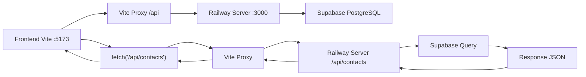

# Arquitetura do Frontend - Operabase Railway

## 📋 Visão Geral

Este documento descreve a arquitetura completa do frontend da Operabase, um sistema de gestão para clínicas médicas construído com **React 18**, **Vite**, **TypeScript**, **TanStack Query** e **Tailwind CSS**, integrado com **Railway Unified Server** para desenvolvimento local.

## 🌐 Conectividade Frontend-Backend

### Arquitetura Railway Local
- **Frontend**: Vite Dev Server (HTTP) - `http://localhost:5173`
- **Backend**: Railway Unified Server (HTTP) - `http://localhost:3000`
- **Database**: Supabase PostgreSQL (HTTPS)
- **Proxy**: Vite proxy interno para desenvolvimento

### Configuração de Desenvolvimento

#### Vite Proxy Configuration
```typescript
// vite.config.ts - Proxy para desenvolvimento
export default defineConfig({
  server: {
    port: 5173,
    proxy: {
      '/api': {
        target: 'http://localhost:3000',
        changeOrigin: true,
        secure: false,
      },
    },
  },
});
```

#### API Client Configuration
```typescript
// src/lib/api.ts - Configuração simplificada
function buildApiUrl(endpoint: string): string {
  // Para desenvolvimento local: sempre usar proxy Vite
  // /api/contacts -> Vite proxy -> http://localhost:3000/api/contacts
  return `/api${endpoint}`;
}

// Exemplo de uso
export async function fetchAppointments(clinicId: number) {
  const response = await fetch(buildApiUrl(`/appointments?clinic_id=${clinicId}`));
  return response.json();
}

export async function fetchContacts(clinicId: number) {
  const response = await fetch(buildApiUrl(`/contacts?clinic_id=${clinicId}`));
  return response.json();
}

export async function fetchContact(id: number, clinicId: number) {
  const response = await fetch(buildApiUrl(`/contacts/${id}?clinic_id=${clinicId}`));
  return response.json();
}
```

### Fluxo de Dados Railway


## 🏗️ Stack Tecnológico

### Core Technologies
- **Runtime**: Node.js 18.x
- **Build Tool**: Vite 5.4.19
- **Framework**: React 18.x
- **Language**: TypeScript 5.x
- **State Management**: TanStack Query v4
- **Styling**: Tailwind CSS 3.x
- **UI Components**: Shadcn/UI + Radix UI
- **Routing**: React Router DOM v6

### Development Tools
- **Linting**: ESLint + Prettier
- **Type Checking**: TypeScript strict mode
- **Hot Reload**: Vite HMR
- **Package Manager**: npm

## 🏗️ Estrutura de Diretórios

```
src/
├── components/                # Componentes reutilizáveis
│   ├── ui/                   # Componentes base (Shadcn/UI)
│   ├── features/             # Componentes específicos por feature
│   ├── editor2/              # Sistema de editor visual
│   └── [shared components]   # Componentes compartilhados
├── contexts/                 # React Contexts
├── hooks/                    # Custom hooks
├── lib/                      # Utilitários e configurações
├── pages/                    # Páginas da aplicação
├── stores/                   # Zustand stores
├── types/                    # Definições TypeScript
├── utils/                    # Funções utilitárias
└── styles/                   # Estilos globais
```

## 🔌 Sistema de Conectividade

### API Client Railway

#### buildApiUrl() - Roteamento Simplificado
```typescript
// src/lib/api.ts - Função simplificada para Railway
function buildApiUrl(endpoint: string): string {
  // Sempre usar proxy Vite para desenvolvimento local
  // Remove duplicate /api if present
  const cleanEndpoint = endpoint.startsWith('/api') ? endpoint : `/api${endpoint}`;
  return cleanEndpoint;
}

// Teste de conectividade
export async function testConnection() {
  try {
    const response = await fetch('/api/health');
    const health = await response.json();
    console.log('✅ Conectividade Railway:', health);
    return health;
  } catch (error) {
    console.error('❌ Erro de conectividade:', error);
    throw error;
    }
  }
```

### Sistema de Fetch Padronizado

#### API Base Functions
```typescript
// src/lib/api.ts - Funções base para Railway
export async function apiRequest<T>(
  endpoint: string,
  options: RequestInit = {}
): Promise<T> {
  const url = buildApiUrl(endpoint);
  
  const defaultOptions: RequestInit = {
    headers: {
      'Content-Type': 'application/json',
      // Auth headers serão adicionados quando implementarmos autenticação
    },
  };

  const response = await fetch(url, {
    ...defaultOptions,
    ...options,
  });

  if (!response.ok) {
    throw new Error(`API Error: ${response.status} ${response.statusText}`);
  }

  return response.json();
}

// APIs específicas para Railway
export const appointmentsApi = {
  getAll: (clinicId: number) => 
    apiRequest<Appointment[]>(`/appointments?clinic_id=${clinicId}`),
  
  getByContact: (clinicId: number, contactId: number) =>
    apiRequest<Appointment[]>(`/appointments?clinic_id=${clinicId}&contact_id=${contactId}`),
  
  getByDate: (clinicId: number, date: string) =>
    apiRequest<Appointment[]>(`/appointments?clinic_id=${clinicId}&date=${date}`)
};

export const contactsApi = {
  getAll: (clinicId: number) =>
    apiRequest<Contact[]>(`/contacts?clinic_id=${clinicId}`),
    
  getById: (id: number, clinicId: number) =>
    apiRequest<Contact>(`/contacts/${id}?clinic_id=${clinicId}`),
    
  search: (clinicId: number, searchTerm: string) =>
    apiRequest<Contact[]>(`/contacts?clinic_id=${clinicId}&search=${searchTerm}`)
};

export const clinicApi = {
  getUsers: (clinicId: number) =>
    apiRequest<User[]>(`/clinic/${clinicId}/users/management`),
    
  getConfig: (clinicId: number) =>
    apiRequest<ClinicConfig>(`/clinic/${clinicId}/config`)
};
```

## 🔄 Gerenciamento de Estado

### TanStack Query Configuration Railway

#### Query Client Setup
```typescript
// src/main.tsx - Configuração otimizada para Railway
import { QueryClient, QueryClientProvider } from '@tanstack/react-query';
import { ReactQueryDevtools } from '@tanstack/react-query-devtools';

const queryClient = new QueryClient({
  defaultOptions: {
    queries: {
      staleTime: 2 * 60 * 1000, // 2 minutos (Railway local é rápido)
      cacheTime: 10 * 60 * 1000, // 10 minutos
      retry: 3,
      retryDelay: (attemptIndex) => Math.min(1000 * 2 ** attemptIndex, 30000),
      refetchOnWindowFocus: false, // Desabilitado para desenvolvimento
    },
    mutations: {
      retry: 1,
    },
  },
});

function App() {
  return (
    <QueryClientProvider client={queryClient}>
      <Router>
        <Routes>
          {/* Rotas da aplicação */}
        </Routes>
      </Router>
      <ReactQueryDevtools initialIsOpen={false} />
    </QueryClientProvider>
  );
}
```

#### Custom Hooks Otimizados para Railway

##### Appointments Hooks
```typescript
// src/hooks/useAppointments.ts - Hooks para Railway
export function useAppointments(clinicId: number) {
  return useQuery({
    queryKey: ['/api/appointments', { clinic_id: clinicId }],
    queryFn: () => appointmentsApi.getAll(clinicId),
    enabled: !!clinicId,
  });
}

export function useAppointmentsByContact(clinicId: number, contactId: number) {
  return useQuery({
    queryKey: ['/api/appointments', { clinic_id: clinicId, contact_id: contactId }],
    queryFn: () => appointmentsApi.getByContact(clinicId, contactId),
    enabled: !!clinicId && !!contactId,
  });
}
```

##### Contacts Hooks
```typescript
// src/hooks/useContacts.ts - Hooks para Railway
export function useContacts(clinicId: number) {
  return useQuery({
    queryKey: ['/api/contacts', { clinic_id: clinicId }],
    queryFn: () => contactsApi.getAll(clinicId),
    enabled: !!clinicId,
  });
}

export function useContact(id: number, clinicId: number) {
  return useQuery({
    queryKey: ['/api/contacts', id, { clinic_id: clinicId }],
    queryFn: () => contactsApi.getById(id, clinicId),
    enabled: !!id && !!clinicId,
  });
}

export function useContactSearch(clinicId: number, searchTerm: string) {
  return useQuery({
    queryKey: ['/api/contacts', { clinic_id: clinicId, search: searchTerm }],
    queryFn: () => contactsApi.search(clinicId, searchTerm),
    enabled: !!clinicId && searchTerm.length > 2,
    staleTime: 30 * 1000, // 30 segundos para busca
  });
}
```

##### Clinic Management Hooks
```typescript
// src/hooks/useClinic.ts - Hooks para Railway
export function useClinicUsers(clinicId: number) {
  return useQuery({
    queryKey: ['/api/clinic', clinicId, 'users', 'management'],
    queryFn: () => clinicApi.getUsers(clinicId),
    enabled: !!clinicId,
  });
}

export function useClinicConfig(clinicId: number) {
  return useQuery({
    queryKey: ['/api/clinic', clinicId, 'config'],
    queryFn: () => clinicApi.getConfig(clinicId),
    enabled: !!clinicId,
    staleTime: 5 * 60 * 1000, // 5 minutos (config muda pouco)
  });
}
```

## 📱 Páginas e Roteamento Railway

### Contact Detail Page (Visão Geral)
```typescript
// src/pages/contatos/[id]/visao-geral.tsx - Página de detalhes
import { useParams } from 'react-router-dom';
import { useContact, useAppointmentsByContact } from '@/hooks';

export default function ContactDetailPage() {
  const { id } = useParams<{ id: string }>();
  const contactId = parseInt(id!);
  const clinicId = 1; // TODO: Get from auth context
  
  const { data: contact, isLoading: contactLoading, error: contactError } = useContact(contactId, clinicId);
  const { data: appointments, isLoading: appointmentsLoading } = useAppointmentsByContact(clinicId, contactId);

  if (contactLoading) {
    return (
      <div className="container mx-auto p-6">
        <div className="animate-pulse">
          <div className="h-8 bg-gray-200 rounded w-1/4 mb-4"></div>
          <div className="h-4 bg-gray-200 rounded w-1/2 mb-2"></div>
          <div className="h-4 bg-gray-200 rounded w-1/3"></div>
        </div>
      </div>
    );
}

  if (contactError) {
  return (
      <div className="container mx-auto p-6">
        <div className="bg-red-50 border border-red-200 rounded-md p-4">
          <h2 className="text-red-800 font-semibold">Contato não encontrado</h2>
          <p className="text-red-600">O contato solicitado não foi encontrado ou você não tem permissão para acessá-lo.</p>
        </div>
      </div>
    );
  }

  if (!contact) {
  return (
    <div className="container mx-auto p-6">
        <div className="text-center py-8">
          <p className="text-gray-500">Contato não encontrado</p>
      </div>
    </div>
  );
}

  return (
    <div className="container mx-auto p-6">
      <div className="mb-6">
        <h1 className="text-2xl font-bold">{contact.name}</h1>
        <p className="text-gray-600">{contact.email}</p>
        <p className="text-gray-600">{contact.phone}</p>
      </div>
      
      <div className="grid grid-cols-1 lg:grid-cols-2 gap-6">
        <div>
          <h2 className="text-lg font-semibold mb-4">Informações do Contato</h2>
          <div className="bg-white rounded-lg border p-4">
            <div className="space-y-2">
              <div>
                <span className="font-medium">Status:</span>
                <span className="ml-2">{contact.status}</span>
              </div>
              <div>
                <span className="font-medium">Prioridade:</span>
                <span className="ml-2">{contact.priority}</span>
              </div>
              <div>
                <span className="font-medium">Fonte:</span>
                <span className="ml-2">{contact.source}</span>
              </div>
              <div>
                <span className="font-medium">Primeiro Contato:</span>
                <span className="ml-2">{new Date(contact.first_contact).toLocaleDateString()}</span>
              </div>
            </div>
          </div>
      </div>
      
        <div>
          <h2 className="text-lg font-semibold mb-4">Agendamentos</h2>
          <div className="bg-white rounded-lg border p-4">
            {appointmentsLoading ? (
              <div className="text-center py-4">
                <div className="animate-spin rounded-full h-6 w-6 border-b-2 border-blue-600 mx-auto"></div>
              </div>
            ) : appointments && appointments.length > 0 ? (
              <div className="space-y-2">
                {appointments.map((appointment) => (
                  <div key={appointment.id} className="p-3 bg-gray-50 rounded">
                    <div className="font-medium">{new Date(appointment.scheduled_date).toLocaleDateString()}</div>
                    <div className="text-sm text-gray-600">{appointment.notes}</div>
                  </div>
                ))}
              </div>
            ) : (
              <p className="text-gray-500 text-center py-4">Nenhum agendamento encontrado</p>
            )}
          </div>
        </div>
      </div>
    </div>
  );
}
```

### Router Configuration Railway
```typescript
// src/main.tsx - Configuração de rotas
import { createBrowserRouter, RouterProvider } from 'react-router-dom';

const router = createBrowserRouter([
  {
    path: '/',
    element: <RootLayout />,
    children: [
      { index: true, element: <DashboardPage /> },
      { path: 'consultas', element: <AppointmentsPage /> },
      { path: 'contatos', element: <ContactsPage /> },
      { path: 'contatos/:id', element: <ContactLayout />, children: [
        { index: true, element: <Navigate to="visao-geral" replace /> },
        { path: 'visao-geral', element: <ContactDetailPage /> },
        { path: 'agendamentos', element: <ContactAppointmentsPage /> },
        { path: 'conversas', element: <ContactConversationsPage /> },
      ]},
      { path: 'calendar', element: <CalendarPage /> },
      { path: 'pipeline', element: <PipelinePage /> },
      { path: 'settings', element: <SettingsPage /> },
    ],
  },
  { path: '/login', element: <LoginPage /> },
]);
```

## 🎨 Sistema de UI

### Loading States Railway-Optimized
```typescript
// src/components/LoadingStates.tsx - Estados de loading otimizados
export function ContactDetailSkeleton() {
  return (
    <div className="container mx-auto p-6">
      <div className="animate-pulse">
        {/* Header skeleton */}
        <div className="mb-6">
          <div className="h-8 bg-gray-200 rounded w-1/4 mb-2"></div>
          <div className="h-4 bg-gray-200 rounded w-1/3 mb-1"></div>
          <div className="h-4 bg-gray-200 rounded w-1/4"></div>
        </div>
        
        {/* Content skeleton */}
        <div className="grid grid-cols-1 lg:grid-cols-2 gap-6">
          <div className="bg-white rounded-lg border p-4">
            <div className="h-6 bg-gray-200 rounded w-1/2 mb-4"></div>
            <div className="space-y-3">
              {[...Array(4)].map((_, i) => (
                <div key={i} className="flex">
                  <div className="h-4 bg-gray-200 rounded w-1/3 mr-2"></div>
                  <div className="h-4 bg-gray-200 rounded w-1/2"></div>
                </div>
              ))}
            </div>
          </div>
          
          <div className="bg-white rounded-lg border p-4">
            <div className="h-6 bg-gray-200 rounded w-1/2 mb-4"></div>
            <div className="space-y-3">
              {[...Array(3)].map((_, i) => (
                <div key={i} className="p-3 bg-gray-50 rounded">
                  <div className="h-4 bg-gray-200 rounded w-1/4 mb-2"></div>
                  <div className="h-3 bg-gray-200 rounded w-3/4"></div>
                </div>
              ))}
            </div>
          </div>
        </div>
      </div>
    </div>
  );
    }

export function AppointmentCardSkeleton() {
  return (
    <div className="bg-white rounded-lg border p-4 animate-pulse">
      <div className="flex justify-between items-start mb-3">
        <div className="h-5 bg-gray-200 rounded w-1/3"></div>
        <div className="h-5 bg-gray-200 rounded w-16"></div>
      </div>
      <div className="h-4 bg-gray-200 rounded w-1/2 mb-2"></div>
      <div className="h-3 bg-gray-200 rounded w-3/4"></div>
    </div>
  );
    }
```

### Error Handling Railway
```typescript
// src/components/ErrorStates.tsx - Estados de erro para Railway
export function ContactNotFound() {
  return (
    <div className="container mx-auto p-6">
      <div className="bg-red-50 border border-red-200 rounded-md p-6 text-center">
        <div className="mx-auto flex items-center justify-center h-12 w-12 rounded-full bg-red-100 mb-4">
          <svg className="h-6 w-6 text-red-600" fill="none" viewBox="0 0 24 24" stroke="currentColor">
            <path strokeLinecap="round" strokeLinejoin="round" strokeWidth={2} d="M12 9v2m0 4h.01m-6.938 4h13.856c1.54 0 2.502-1.667 1.732-2.5L13.732 4c-.77-.833-1.732-.833-2.5 0L4.268 19.5c-.77.833.192 2.5 1.732 2.5z" />
          </svg>
        </div>
        <h2 className="text-red-800 font-semibold text-lg mb-2">Contato não encontrado</h2>
        <p className="text-red-600 mb-4">O contato solicitado não foi encontrado ou você não tem permissão para acessá-lo.</p>
        <button 
          onClick={() => window.history.back()}
          className="bg-red-600 text-white px-4 py-2 rounded hover:bg-red-700"
        >
          Voltar
        </button>
      </div>
    </div>
  );
}

export function ApiConnectionError({ onRetry }: { onRetry: () => void }) {
  return (
    <div className="bg-yellow-50 border border-yellow-200 rounded-md p-4">
      <div className="flex">
        <div className="flex-shrink-0">
          <svg className="h-5 w-5 text-yellow-400" viewBox="0 0 20 20" fill="currentColor">
            <path fillRule="evenodd" d="M8.257 3.099c.765-1.36 2.722-1.36 3.486 0l5.58 9.92c.75 1.334-.213 2.98-1.742 2.98H4.42c-1.53 0-2.493-1.646-1.743-2.98l5.58-9.92zM11 13a1 1 0 11-2 0 1 1 0 012 0zm-1-8a1 1 0 00-1 1v3a1 1 0 002 0V6a1 1 0 00-1-1z" clipRule="evenodd" />
          </svg>
        </div>
        <div className="ml-3">
          <h3 className="text-sm font-medium text-yellow-800">Erro de Conexão</h3>
          <div className="mt-2 text-sm text-yellow-700">
            <p>Não foi possível conectar com o servidor. Verifique se o Railway server está rodando.</p>
          </div>
          <div className="mt-4">
            <button
              onClick={onRetry}
              className="bg-yellow-600 text-white px-3 py-1 rounded text-sm hover:bg-yellow-700"
            >
              Tentar novamente
            </button>
          </div>
        </div>
      </div>
    </div>
  );
}
```

## 📊 Monitoramento e Debug Railway

### Connection Monitor
```typescript
// src/hooks/useConnectionMonitor.ts - Monitor de conexão Railway
export function useConnectionMonitor() {
  const [isOnline, setIsOnline] = useState(true);
  const [railwayStatus, setRailwayStatus] = useState<'connected' | 'disconnected' | 'checking'>('checking');

  useEffect(() => {
    const checkRailwayConnection = async () => {
      try {
        const response = await fetch('/api/health', { 
          method: 'GET',
          headers: { 'Cache-Control': 'no-cache' }
        });
        
        if (response.ok) {
          const health = await response.json();
          setRailwayStatus('connected');
          console.log('✅ Railway server conectado:', health);
        } else {
          setRailwayStatus('disconnected');
          console.warn('⚠️ Railway server respondeu com erro:', response.status);
}
      } catch (error) {
        setRailwayStatus('disconnected');
        console.error('❌ Railway server desconectado:', error);
      }
    };

    // Check inicial
    checkRailwayConnection();

    // Check periódico a cada 30 segundos
    const interval = setInterval(checkRailwayConnection, 30000);

    // Monitor de conectividade do navegador
    const handleOnline = () => setIsOnline(true);
    const handleOffline = () => setIsOnline(false);

    window.addEventListener('online', handleOnline);
    window.addEventListener('offline', handleOffline);

    return () => {
      clearInterval(interval);
      window.removeEventListener('online', handleOnline);
      window.removeEventListener('offline', handleOffline);
    };
  }, []);

  return { isOnline, railwayStatus };
}
```

### Debug Panel
```typescript
// src/components/DebugPanel.tsx - Painel de debug para desenvolvimento
export function DebugPanel() {
  const { isOnline, railwayStatus } = useConnectionMonitor();
  const [debugInfo, setDebugInfo] = useState<any>(null);

  const fetchDebugInfo = async () => {
    try {
      const health = await fetch('/api/health').then(r => r.json());
      const contacts = await fetch('/api/contacts?clinic_id=1').then(r => r.json());
      const appointments = await fetch('/api/appointments?clinic_id=1').then(r => r.json());
      const whatsappNumbers = await fetch('/api/whatsapp/numbers').then(r => r.json());
      const conversations = await fetch('/api/conversations-simple?clinic_id=1').then(r => r.json());
      
      setDebugInfo({
        health,
        contactsCount: contacts.length,
        appointmentsCount: appointments.length,
        whatsappNumbersCount: whatsappNumbers.length,
        conversationsCount: conversations.length,
        timestamp: new Date().toISOString()
      });
    } catch (error) {
      setDebugInfo({ error: error.message });
  }
  };

  if (process.env.NODE_ENV !== 'development') {
    return null;
  }

  return (
    <div className="fixed bottom-4 right-4 bg-white border rounded-lg shadow-lg p-4 max-w-sm">
      <h3 className="font-semibold mb-2">Debug Railway</h3>
      
      <div className="space-y-2 text-sm">
        <div className="flex justify-between">
          <span>Navegador:</span>
          <span className={isOnline ? 'text-green-600' : 'text-red-600'}>
            {isOnline ? 'Online' : 'Offline'}
          </span>
        </div>
        
        <div className="flex justify-between">
          <span>Railway:</span>
          <span className={
            railwayStatus === 'connected' ? 'text-green-600' : 
            railwayStatus === 'disconnected' ? 'text-red-600' : 'text-yellow-600'
          }>
            {railwayStatus === 'connected' ? 'Conectado' : 
             railwayStatus === 'disconnected' ? 'Desconectado' : 'Verificando...'}
          </span>
        </div>
        
        <button
          onClick={fetchDebugInfo}
          className="w-full bg-blue-600 text-white py-1 px-2 rounded text-xs hover:bg-blue-700"
        >
          Testar APIs
        </button>
        
        {debugInfo && (
          <div className="mt-2 p-2 bg-gray-50 rounded text-xs">
            <pre>{JSON.stringify(debugInfo, null, 2)}</pre>
          </div>
        )}
      </div>
        </div>
      );
    }

### Detailed Component Logging
```typescript
// src/components/WhatsAppManager.tsx - Logs estruturados implementados
useEffect(() => {
  console.log('[WhatsAppManager][useEffect] Iniciando busca de números WhatsApp...');
  const fetchWhatsAppNumbers = async () => {
    try {
      const authToken = localStorage.getItem('authToken');
      console.log('[WhatsAppManager][fetch] Auth token existe?', !!authToken);
      
      const url = '/api/whatsapp/numbers';
      console.log('[WhatsAppManager][fetch] URL completa:', window.location.origin + url);
      
      const response = await fetch(url, { headers });
      console.log('[WhatsAppManager][fetch] Resposta recebida:', {
        status: response.status,
        statusText: response.statusText,
        ok: response.ok
      });
      
      const responseText = await response.text();
      console.log('[WhatsAppManager][fetch] Resposta bruta:', responseText);
      
      const data = JSON.parse(responseText);
      console.log('[WhatsAppManager][fetch] Dados parseados:', data);
      
      if (Array.isArray(data)) {
        console.log('[WhatsAppManager][fetch] Atualizando estado com', data.length, 'números');
        setWhatsappNumbers(data);
      }
    } catch (error) {
      console.error('[WhatsAppManager][fetch] Erro:', error);
    }
  };
  
  fetchWhatsAppNumbers();
}, []);

// Logs no render para debugging de estado
{!isLoading && whatsappNumbers.length === 0 && (
  (() => { 
    console.log('[WhatsAppManager][render] Nenhum número conectado - whatsappNumbers:', whatsappNumbers); 
    return null; 
  })(),
  <div className="text-center py-8 text-muted-foreground">
    <MessageCircle className="w-12 h-12 mx-auto mb-4 opacity-50" />
    <p className="text-lg font-medium">Nenhum número conectado</p>
    <p className="text-sm">Clique em "Adicionar Número" para conectar seu WhatsApp</p>
  </div>
)}

{whatsappNumbers.length > 0 && (
  (() => { 
    console.log('[WhatsAppManager][render] Renderizando lista com', whatsappNumbers.length, 'números'); 
    return null; 
  })(),
  <div className="space-y-4">
    {whatsappNumbers.map((number) => {
      console.log('[WhatsAppManager][render] Renderizando número:', number);
      return (
        <WhatsAppNumberCard key={number.id} number={number} />
      );
    })}
  </div>
)}
```
```

## 🚀 Build e Deploy Railway

### Vite Configuration Railway
```typescript
// vite.config.ts - Configuração otimizada para Railway
import { defineConfig } from 'vite';
import react from '@vitejs/plugin-react';
import path from 'path';

export default defineConfig({
  plugins: [react()],
  resolve: {
    alias: {
      '@': path.resolve(__dirname, './src'),
    },
  },
  server: {
    port: 5173,
    proxy: {
      '/api': {
        target: 'http://localhost:3000',
        changeOrigin: true,
        secure: false,
      },
    },
  },
  build: {
    outDir: 'dist',
    sourcemap: true,
    rollupOptions: {
      output: {
        manualChunks: {
          vendor: ['react', 'react-dom'],
          router: ['react-router-dom'],
          query: ['@tanstack/react-query'],
          ui: ['@radix-ui/react-dialog', '@radix-ui/react-dropdown-menu'],
        },
      },
    },
  },
});
```

### Package.json Scripts Railway
```json
{
  "scripts": {
    "dev": "vite",
    "dev:railway": "tsx server/railway-server.ts",
    "build": "tsc && vite build",
    "preview": "vite preview",
    "lint": "eslint . --ext ts,tsx --report-unused-disable-directives --max-warnings 0",
    "lint:fix": "eslint . --ext ts,tsx --fix",
    "type-check": "tsc --noEmit",
    "dev:full": "concurrently \"npm run dev:railway\" \"npm run dev\""
  }
}
```

## 🔧 Configuração de Desenvolvimento Railway

### Environment Variables
```bash
# .env.local - Configuração para desenvolvimento Railway
VITE_API_URL=http://localhost:3000
VITE_APP_NAME=Operabase
VITE_ENVIRONMENT=development
```

### Fluxo de Desenvolvimento
```bash
# Opção 1: Executar separadamente
# Terminal 1: Backend Railway
npm run dev:railway

# Terminal 2: Frontend Vite
npm run dev

# Opção 2: Executar junto (se tiver concurrently instalado)
npm run dev:full

# Acessar aplicação
open http://localhost:5173
```

### TypeScript Configuration Railway
```json
// tsconfig.json - Configuração para Railway
{
  "compilerOptions": {
    "target": "ES2020",
    "useDefineForClassFields": true,
    "lib": ["ES2020", "DOM", "DOM.Iterable"],
    "module": "ESNext",
    "skipLibCheck": true,
    "moduleResolution": "bundler",
    "allowImportingTsExtensions": true,
    "resolveJsonModule": true,
    "isolatedModules": true,
    "noEmit": true,
    "jsx": "react-jsx",
    "strict": true,
    "noUnusedLocals": true,
    "noUnusedParameters": true,
    "noFallthroughCasesInSwitch": true,
    "baseUrl": ".",
    "paths": {
      "@/*": ["./src/*"]
    }
  },
  "include": ["src"],
  "references": [{ "path": "./tsconfig.node.json" }]
}
```

## 📋 Checklist de Desenvolvimento Railway

### ✅ Funcionalidades Implementadas e Validadas
- ✅ **Vite Proxy** - Configurado para Railway (:3000)
- ✅ **TanStack Query** - Query keys otimizadas para Railway
- ✅ **API Client** - Funções específicas para endpoints Railway
- ✅ **Contact Detail Page** - Página de visão geral funcionando
- ✅ **Error Handling** - Estados de erro específicos para Railway
- ✅ **Loading States** - Skeletons otimizados
- ✅ **Connection Monitor** - Monitor de conectividade Railway
- ✅ **Debug Panel** - Painel de debug para desenvolvimento
- ✅ **WhatsApp Manager** - Componente com logs detalhados ✨ **NOVO**
- ✅ **Conversations System** - Sistema de conversas funcionando ✨ **NOVO**
- ✅ **Detailed Logging** - Sistema de logs estruturados ✨ **NOVO**

### 🚧 Funcionalidades Pendentes
- ⏳ **Authentication** - Sistema de login/logout
- ⏳ **Offline Support** - Funcionamento offline com cache
- ⏳ **Real-time Updates** - Polling ou WebSockets
- ⏳ **PWA** - Progressive Web App
- ⏳ **Push Notifications** - Notificações em tempo real

### 🔄 Padrões de Desenvolvimento Railway

#### Component Pattern Railway
```typescript
// Padrão de componente otimizado para Railway
interface ComponentProps {
  clinicId: number;
  // Props tipadas
}

export function RailwayComponent({ clinicId, ...props }: ComponentProps) {
  // Hooks Railway-optimized
  const { data, isLoading, error } = useContacts(clinicId);
  const { railwayStatus } = useConnectionMonitor();
  
  // Early returns para Railway
  if (railwayStatus === 'disconnected') {
    return <ApiConnectionError onRetry={() => window.location.reload()} />;
  }
  
  if (isLoading) return <ContactDetailSkeleton />;
  if (error) return <ContactNotFound />;
  
  // Main render
  return (
    <div className="container mx-auto p-6">
      {/* JSX optimized for Railway data */}
    </div>
  );
}
```

#### Hook Pattern Railway
```typescript
// Padrão de custom hook para Railway
export function useRailwayFeature(clinicId: number, params: FeatureParams) {
  // Connection monitoring
  const { railwayStatus } = useConnectionMonitor();
  
  // Query with Railway-specific key
  const query = useQuery({
    queryKey: ['/api/feature', { clinic_id: clinicId, ...params }],
    queryFn: () => apiRequest(`/feature?clinic_id=${clinicId}`),
    enabled: !!clinicId && railwayStatus === 'connected',
  });
  
  // Return Railway-optimized interface
  return {
    data: query.data,
    isLoading: query.isLoading,
    error: query.error,
    isRailwayConnected: railwayStatus === 'connected',
    refetch: query.refetch,
  };
}
```

## 🎯 Próximos Passos Railway

### Prioridade Alta
1. **Implementar Authentication** - Sistema de login/logout
2. **Contact CRUD** - Criar, editar, deletar contatos
3. **Appointment CRUD** - Gerenciamento completo de agendamentos
4. **Real-time Updates** - Polling ou WebSockets

### Prioridade Média
1. **Offline Support** - Cache local com sync
2. **Performance Optimization** - Code splitting otimizado
3. **Error Tracking** - Sentry ou similar
4. **Analytics** - Tracking de uso

### Prioridade Baixa
1. **PWA Configuration** - Service Worker
2. **Dark Mode** - Tema escuro
3. **Internationalization** - Suporte a idiomas
4. **Accessibility** - Melhorias A11Y

---

## 📞 Suporte e Recursos Railway

### Comandos Úteis Railway
```bash
# Status dos serviços
lsof -i :3000  # Railway Server
lsof -i :5173  # Vite Dev Server

# Testar conectividade
curl http://localhost:3000/health
curl http://localhost:5173/api/health

# Debug de proxy
curl -v http://localhost:5173/api/contacts?clinic_id=1

# Build para produção
npm run build
npm run dev:railway  # Serve static files
```

### Troubleshooting Railway
- **Proxy 404**: Verificar se Railway server está rodando na porta 3000
- **CORS Error**: Verificar configuração CORS no Railway server
- **API Error**: Verificar logs do Railway server no terminal
- **Build Error**: Verificar se todos os tipos estão corretos

### Ferramentas de Debug Railway
- **React DevTools** - Extensão do navegador
- **TanStack Query DevTools** - Integrado no desenvolvimento
- **Network Tab** - Para verificar requests /api
- **Debug Panel** - Componente customizado para desenvolvimento

---

*Documentação atualizada em: Janeiro 2025*
*Versão: v2.0 Railway*
*Status: ✅ Desenvolvimento Local* 