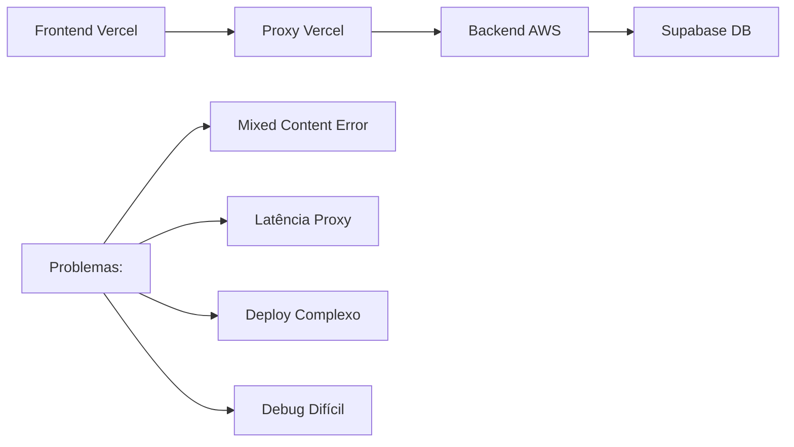
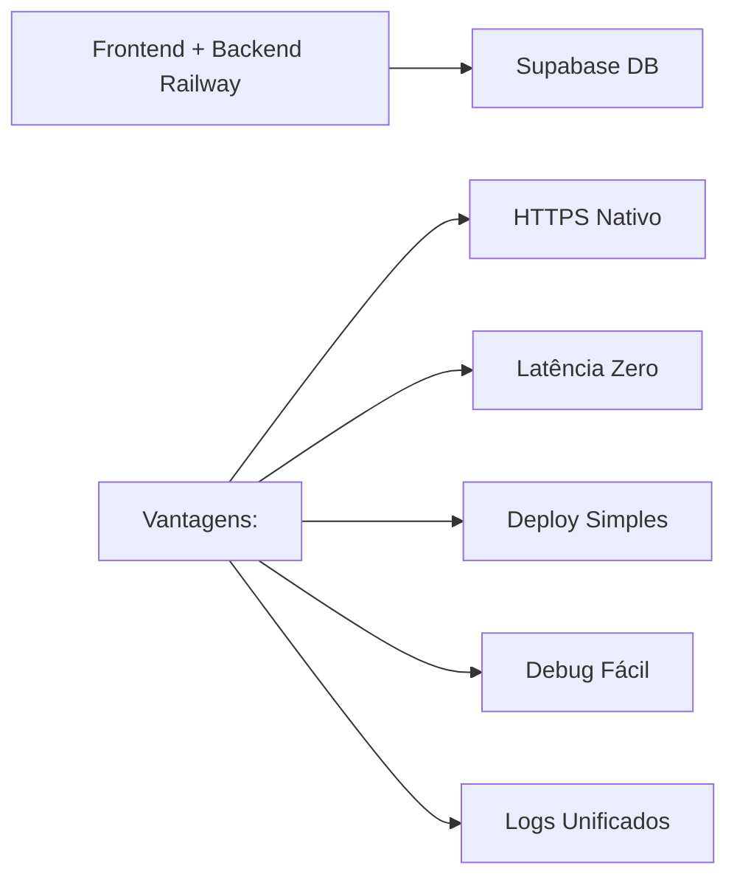

# Plano de Migração para Railway - Modelo Unificado

## 📋 Visão Geral

Este documento apresenta um plano detalhado para migrar o sistema Operabase do modelo distribuído atual (Vercel + AWS) para o **Railway com modelo unificado** (Frontend + Backend no mesmo servidor), baseado na análise do PainelEspelho e do sistema atual.

---

## 🔍 **ANÁLISE DO ESTADO ATUAL**

### ✅ **O que JÁ FUNCIONA no Modelo Unificado**

#### 1. **Sistema de Autenticação Completo**
```typescript
// ✅ JÁ FUNCIONA - server/auth.ts
- Login/Logout com Passport.js
- Autenticação JWT Supabase  
- Middleware isAuthenticated
- Controle multi-tenant
- Endpoints: /api/login, /api/logout, /api/user
```

#### 2. **Core APIs Funcionais**
```typescript
// ✅ JÁ FUNCIONAM - Testados e validados
- /api/appointments (90+ registros)
- /api/contacts (35+ contatos)  
- /api/conversations (WhatsApp)
- /api/anamneses (Templates)
- /api/mcp/* (Integração N8N)
- /api/rag/* (Base conhecimento)
- /api/cache/* (Gestão cache)
```

#### 3. **Sistema de Domains Completo**
```typescript
// ✅ JÁ FUNCIONA - server/domains/
- appointments/ (Controller + Service + Repository)
- contacts/ (CRUD completo)
- auth/ (Autenticação)
- calendar/ (Sistema calendário)
- medical-records/ (Prontuários)
- pipeline/ (Funil vendas)
- analytics/ (Relatórios)
- settings/ (Configurações)
- livia/ (IA Assistant)
- user-profile/ (Perfil usuário)
```

#### 4. **Infrastructure Robusta**
```typescript
// ✅ JÁ FUNCIONA
- Supabase PostgreSQL (conexão estável)
- Redis Cache (com fallback memory)
- Multi-tenant isolation
- Performance monitoring
- Structured logging
- Error handling
```

#### 5. **Frontend Vite Integrado**
```typescript
// ✅ JÁ FUNCIONA - server/vite.ts
- Servidor Vite integrado no Express
- Hot reload funcionando
- Build automático para produção
- Servir arquivos estáticos
```

### 🚧 **O que PRECISA SER AJUSTADO**

#### 1. **Sistema de Proxy (Não Necessário)**
```typescript
// ❌ REMOVER - api/*.js (Vercel proxies)
- api/[...path].js
- api/appointments.js  
- api/contacts.js
- api/clinic/[clinicId]/*
```

#### 2. **Configuração Frontend**
```typescript
// 🔧 AJUSTAR - src/lib/api.ts
// ANTES: Proxy para AWS
function buildApiUrl(endpoint: string): string {
  return `/api${endpoint}`; // Via proxy Vercel
}

// DEPOIS: Direto para servidor unificado
function buildApiUrl(endpoint: string): string {
  if (import.meta.env.DEV) {
    return `http://localhost:5000/api${endpoint}`;
  }
  return `/api${endpoint}`; // Mesmo servidor
}
```

#### 3. **Deploy Configuration**
```yaml
# ❌ REMOVER - .github/workflows/deploy-aws.yml
# ❌ REMOVER - vercel.json
# ✅ ADICIONAR - Railway deploy config
```

---

## 🚀 **PLANO DE MIGRAÇÃO RAILWAY**

### **FASE 1: Preparação Local (1-2 dias)**

#### 1.1 **Consolidar Servidor Unificado**
```typescript
// ✅ USAR COMO BASE - PainelEspelho/server/index.ts
// Já tem tudo integrado:
- Express + Vite
- Frontend servido pelo backend
- API routes funcionais
- Middleware chain completo
```

#### 1.2 **Ajustar Frontend para Modelo Unificado**
```typescript
// 🔧 ATUALIZAR - src/lib/api.ts
const API_BASE = import.meta.env.DEV 
  ? 'http://localhost:5000' 
  : ''; // Mesmo servidor em produção

function buildApiUrl(endpoint: string): string {
  return `${API_BASE}/api${endpoint}`;
}
```

#### 1.3 **Remover Dependências do Proxy**
```bash
# 🗑️ DELETAR arquivos desnecessários
rm -rf api/
rm vercel.json
rm .github/workflows/deploy-aws.yml
```

#### 1.4 **Atualizar Package.json**
```json
{
  "scripts": {
    "dev": "tsx server/index.ts",
    "build": "npm run build:frontend && npm run build:backend",
    "build:frontend": "vite build",
    "build:backend": "tsc",
    "start": "node dist/server/index.js",
    "railway:dev": "npm run dev",
    "railway:build": "npm run build",
    "railway:start": "npm start"
  }
}
```

### **FASE 2: Configuração Railway (1 dia)**

#### 2.1 **Criar Projeto Railway**
```bash
# 1. Instalar Railway CLI
npm install -g @railway/cli

# 2. Login
railway login

# 3. Criar projeto
railway new operabase-unified

# 4. Conectar repositório
railway link
```

#### 2.2 **Configurar Variáveis de Ambiente**
```bash
# Railway Dashboard > Variables
SUPABASE_URL=https://lkwrevhxugaxfpwiktdy.supabase.co
SUPABASE_ANON_KEY=eyJhbGciOiJIUzI1NiIsInR5cCI6IkpXVCJ9...
SUPABASE_SERVICE_ROLE_KEY=eyJhbGciOiJIUzI1NiIsInR5cCI6IkpXVCJ9...
SUPABASE_POOLER_URL=postgresql://postgres.lkwrevhxugaxfpwiktdy...

# Redis (Railway addon)
REDIS_HOST=${{Redis.REDIS_HOST}}
REDIS_PORT=${{Redis.REDIS_PORT}}
REDIS_PASSWORD=${{Redis.REDIS_PASSWORD}}

# Session
SESSION_SECRET=your-session-secret

# Evolution API (WhatsApp)
EVOLUTION_API_URL=https://your-evolution-instance.com
EVOLUTION_API_KEY=your-api-key

NODE_ENV=production
PORT=3000
```

#### 2.3 **Configurar Deploy Automático**
```toml
# railway.toml
[build]
builder = "nixpacks"
buildCommand = "npm run railway:build"

[deploy]
startCommand = "npm run railway:start"
healthcheckPath = "/health"
healthcheckTimeout = 300
restartPolicyType = "on_failure"
restartPolicyMaxRetries = 3

[environments.production]
variables = {}

[environments.staging]
variables = {}
```

### **FASE 3: Teste e Validação (2-3 dias)**

#### 3.1 **Deploy de Teste**
```bash
# Deploy para staging
railway up --environment staging

# Verificar logs
railway logs --environment staging

# Teste de endpoints
curl https://operabase-staging.railway.app/health
curl https://operabase-staging.railway.app/api/appointments?clinic_id=1
```

#### 3.2 **Validação Funcional**
```bash
# ✅ Checklist de validação
- [ ] Frontend carrega corretamente
- [ ] Login funciona
- [ ] API endpoints respondem
- [ ] Consultas aparecem no calendário
- [ ] Contatos carregam
- [ ] Upload de arquivos funciona
- [ ] WhatsApp integration ativa
- [ ] Cache Redis funcionando
- [ ] Logs estruturados salvando
```

#### 3.3 **Performance Testing**
```bash
# Teste de carga
npm run test:load

# Monitorar métricas Railway
- Response time < 500ms
- Memory usage < 512MB
- CPU usage < 50%
- Uptime > 99.9%
```

### **FASE 4: Migration de Dados (1 dia)**

#### 4.1 **Backup Completo**
```bash
# Backup Supabase (dados já estão lá)
# Backup arquivos Vercel Edge Functions (não necessário)
# Backup configurações AWS (migrar para Railway)
```

#### 4.2 **DNS e Domínio**
```bash
# 1. Railway Dashboard > Settings > Domains
# 2. Adicionar domínio customizado: operabase.com
# 3. Configurar DNS CNAME
# 4. SSL automático via Railway
```

### **FASE 5: Go-Live (1 dia)**

#### 5.1 **Deploy Produção**
```bash
# Deploy final
railway up --environment production

# Verificar health checks
railway status --environment production
```

#### 5.2 **Monitoramento Ativo**
```bash
# Logs em tempo real
railway logs --follow --environment production

# Métricas de performance
railway metrics --environment production
```

---

## 🔧 **AJUSTES TÉCNICOS DETALHADOS**

### **1. Servidor Unificado (server/index.ts)**
```typescript
// ✅ ESTRUTURA FINAL
import express from 'express';
import { setupVite } from './vite';
import { createApiRouter } from './api/v1';
import { createStorage } from './storage-factory';
import { setupAuth } from './auth';

const app = express();
const PORT = process.env.PORT || 3000;

(async () => {
  // 1. Setup básico
  app.use(express.json());
  
  // 2. Storage e Auth
  const storage = createStorage();
  setupAuth(app, storage);
  
  // 3. API routes
  const apiRouter = createApiRouter(storage);
  app.use('/api', apiRouter);
  
  // 4. Frontend (Vite)
  if (process.env.NODE_ENV === 'production') {
    app.use(express.static('dist/client'));
    app.get('*', (req, res) => {
      res.sendFile(path.join(__dirname, '../client/index.html'));
    });
  } else {
    await setupVite(app);
  }
  
  app.listen(PORT, () => {
    console.log(`🚀 Operabase unified server running on port ${PORT}`);
  });
})();
```

### **2. Build Process**
```json
// package.json
{
  "scripts": {
    "dev": "tsx server/index.ts",
    "build": "npm run build:frontend && npm run build:backend",
    "build:frontend": "vite build --outDir dist/client",
    "build:backend": "tsc --project tsconfig.server.json --outDir dist",
    "start": "node dist/server/index.js"
  }
}
```

### **3. TypeScript Config**
```json
// tsconfig.server.json
{
  "extends": "./tsconfig.json",
  "compilerOptions": {
    "outDir": "./dist",
    "rootDir": "./server",
    "module": "CommonJS",
    "target": "ES2020"
  },
  "include": ["server/**/*"],
  "exclude": ["node_modules", "dist", "src"]
}
```

---

## 📊 **COMPARAÇÃO: ANTES vs DEPOIS**

### **ANTES (Distribuído)**


### **DEPOIS (Unificado Railway)**


---

## 💰 **ANÁLISE DE CUSTOS**

### **Atual (Vercel + AWS)**
```
- Vercel Pro: $20/mês
- AWS Elastic Beanstalk: $15-30/mês
- Total: $35-50/mês
```

### **Railway (Unificado)**
```
- Railway Pro: $20/mês
- Inclui: 8GB RAM, 8 vCPU, 100GB storage
- Redis addon: $5/mês
- Total: $25/mês (economia de 30-50%)
```

---

## ⚡ **VANTAGENS DO MODELO UNIFICADO**

### **1. Simplicidade Arquitetural**
- ✅ **Um servidor, uma aplicação**
- ✅ **Sem proxies ou gateways**
- ✅ **Logs unificados**
- ✅ **Debug simplificado**

### **2. Performance Superior**
- ✅ **Latência zero** entre frontend/backend
- ✅ **Sem overhead de proxy**
- ✅ **Cache compartilhado**
- ✅ **Conexões persistentes**

### **3. Deploy e Manutenção**
- ✅ **Deploy atômico** (tudo junto)
- ✅ **Rollback simples**
- ✅ **Configuração única**
- ✅ **Monitoramento centralizado**

### **4. Desenvolvimento**
- ✅ **Hot reload** frontend + backend
- ✅ **Debug unificado**
- ✅ **Ambiente idêntico** dev/prod
- ✅ **Testes end-to-end** simples

---

## 🚨 **RISCOS E MITIGAÇÕES**

### **Risco 1: Downtime Durante Migração**
**Mitigação:**
- Deploy paralelo no Railway
- Teste completo antes do switch
- Rollback plan para AWS/Vercel

### **Risco 2: Performance em Produção**
**Mitigação:**
- Load testing antes do go-live
- Monitoramento ativo nas primeiras 48h
- Auto-scaling configurado no Railway

### **Risco 3: Dependências Quebradas**
**Mitigação:**
- Teste local completo
- Staging environment idêntico
- Checklist de validação detalhado

---

## 📅 **CRONOGRAMA EXECUTIVO**

### **Semana 1: Preparação**
- **Dia 1-2**: Consolidar servidor unificado
- **Dia 3-4**: Ajustar frontend e remover proxies
- **Dia 5**: Teste local completo

### **Semana 2: Deploy**
- **Dia 1**: Configurar Railway e staging
- **Dia 2-3**: Teste e validação staging
- **Dia 4**: Deploy produção
- **Dia 5**: Monitoramento e ajustes

### **Total: 10 dias úteis**

---

## ✅ **CHECKLIST DE MIGRAÇÃO**

### **Preparação**
- [ ] Servidor unificado funcionando local
- [ ] Frontend ajustado para modelo unificado
- [ ] Proxies Vercel removidos
- [ ] Package.json atualizado
- [ ] Variáveis ambiente mapeadas

### **Railway Setup**
- [ ] Projeto Railway criado
- [ ] Repositório conectado
- [ ] Variáveis ambiente configuradas
- [ ] Redis addon instalado
- [ ] Deploy automático configurado

### **Teste Staging**
- [ ] Deploy staging funcionando
- [ ] Todos endpoints testados
- [ ] Frontend carregando corretamente
- [ ] Autenticação funcionando
- [ ] Upload arquivos testado
- [ ] Performance validada

### **Go-Live**
- [ ] Deploy produção realizado
- [ ] DNS configurado
- [ ] SSL ativo
- [ ] Monitoramento ativo
- [ ] Logs funcionando
- [ ] Backup confirmado

### **Pós-Deploy**
- [ ] Métricas 24h coletadas
- [ ] Performance validada
- [ ] Usuários testaram
- [ ] Documentação atualizada
- [ ] Equipe treinada

---

## 🎯 **RESULTADO ESPERADO**

### **Sistema Final**
- ✅ **Frontend + Backend unificado** no Railway
- ✅ **HTTPS nativo** sem Mixed Content Error
- ✅ **Performance superior** (latência zero)
- ✅ **Deploy simplificado** (uma aplicação)
- ✅ **Custos reduzidos** (30-50% economia)
- ✅ **Manutenção facilitada** (logs unificados)
- ✅ **Desenvolvimento ágil** (ambiente único)

### **Funcionalidades Preservadas**
- ✅ **100% das funcionalidades** mantidas
- ✅ **Calendário completo** funcionando
- ✅ **WhatsApp integration** ativa
- ✅ **Sistema multi-tenant** preservado
- ✅ **Cache Redis** otimizado
- ✅ **Logs estruturados** mantidos

---

**Este plano garante uma migração segura e eficiente para o modelo unificado Railway, aproveitando toda a infraestrutura já desenvolvida e testada no PainelEspelho, com melhorias significativas em performance, simplicidade e custos.** 