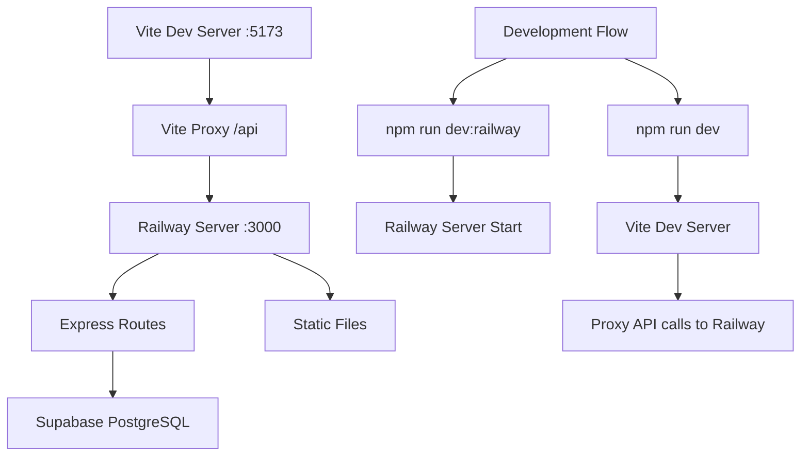

# Arquitetura Railway - Operabase Unified Server

## 📋 Visão Geral

Este documento descreve a **arquitetura Railway Unified Server** da Operabase, uma solução completa que unifica frontend e backend em um único servidor para desenvolvimento local, resolvendo problemas de conectividade e simplificando o fluxo de desenvolvimento.

## 🏗️ Arquitetura Railway Unified Server

### Conceito Principal
A arquitetura Railway combina:
- **Express.js Server** (Backend API)
- **Static File Serving** (Frontend Build)
- **Supabase Integration** (Database)
- **Vite Proxy** (Development)

### Fluxo de Desenvolvimento


### Estrutura de Arquivos Railway
```
server/
├── railway-server.ts          # Servidor principal Railway
├── middleware/
│   ├── auth.ts               # Middleware de autenticação
│   ├── cors.ts               # Configuração CORS
│   └── logging.ts            # Logging de requests
├── routes/
│   ├── appointments.ts       # Rotas de agendamentos
│   ├── contacts.ts           # Rotas de contatos
│   ├── clinic.ts             # Rotas da clínica
│   └── auth.ts               # Rotas de autenticação
└── utils/
    ├── database.ts           # Configuração Supabase
    ├── validation.ts         # Validação de dados
    └── response.ts           # Utilitários de resposta
```

## 🚀 Railway Server Implementation

### Core Server Configuration
```typescript
// server/railway-server.ts - Configuração principal
import express from 'express';
import cors from 'cors';
import path from 'path';
import { createClient } from '@supabase/supabase-js';

const app = express();
const port = process.env.PORT || 3000;

// Supabase Configuration
const supabaseUrl = 'https://lkwrevhxugaxfpwiktdy.supabase.co';
const supabaseServiceKey = process.env.SUPABASE_SERVICE_ROLE_KEY;
const supabaseAdmin = createClient(supabaseUrl, supabaseServiceKey);

// Middleware Stack
app.use(cors({
  origin: ['http://localhost:5173', 'http://localhost:3000'],
  credentials: true
}));

app.use(express.json({ limit: '10mb' }));
app.use(express.urlencoded({ extended: true, limit: '10mb' }));

// Request Logging
app.use((req, res, next) => {
  const timestamp = new Date().toISOString();
  console.log(`[${timestamp}] ${req.method} ${req.path}`);
  next();
});

// Static Files (Production)
const staticPath = path.join(__dirname, '../dist');
app.use(express.static(staticPath));

// Health Check
app.get('/health', (req, res) => {
  res.json({
    status: 'healthy',
    timestamp: new Date().toISOString(),
    environment: process.env.NODE_ENV || 'development',
    version: '2.0.0-railway'
  });
});
```

### Authentication Middleware
```typescript
// Middleware de autenticação Railway
const authMiddleware = async (req: Request, res: Response, next: NextFunction) => {
  try {
    // TODO: Implementar autenticação real
    // Por enquanto, permitir todas as requisições
    next();
  } catch (error) {
    console.error('❌ Erro de autenticação:', error);
    res.status(401).json({ error: 'Não autorizado' });
  }
};
```

## 🔌 API Endpoints Railway

### Appointments Endpoints
```typescript
// GET /api/appointments - Listar agendamentos
app.get('/api/appointments', authMiddleware, async (req: Request, res: Response) => {
  try {
    const { clinic_id, contact_id, date } = req.query;
    
    let query = supabaseAdmin
      .from('appointments')
      .select('*')
      .eq('clinic_id', clinic_id);
    
    if (contact_id) {
      query = query.eq('contact_id', contact_id);
    }
    
    if (date) {
      query = query.gte('scheduled_date', `${date}T00:00:00`)
                   .lt('scheduled_date', `${date}T23:59:59`);
    }
    
    const { data: appointments, error } = await query.order('scheduled_date', { ascending: true });
    
    if (error) {
      console.error('❌ Erro ao buscar agendamentos:', error);
      res.status(500).json({ error: 'Erro ao buscar agendamentos' });
      return;
    }
    
    console.log(`✅ Agendamentos encontrados: ${appointments.length}`);
    res.json(appointments);
  } catch (error) {
    console.error('❌ Erro ao buscar agendamentos:', error);
    res.status(500).json({ error: 'Erro interno do servidor' });
  }
});

// POST /api/appointments - Criar agendamento
app.post('/api/appointments', authMiddleware, async (req: Request, res: Response) => {
  try {
    const appointmentData = req.body;
    console.log('📝 Criando novo agendamento:', appointmentData);
    
    const { data: appointment, error } = await supabaseAdmin
      .from('appointments')
      .insert({
        ...appointmentData,
        clinic_id: 1, // TODO: Get from auth context
        status: 'scheduled'
      })
      .select()
      .single();
    
    if (error) {
      console.error('❌ Erro ao criar agendamento:', error);
      res.status(500).json({ error: 'Erro ao criar agendamento', details: error.message });
      return;
    }
    
    console.log('✅ Agendamento criado:', appointment);
    res.json(appointment);
  } catch (error) {
    console.error('❌ Erro ao criar agendamento:', error);
    res.status(500).json({ error: 'Erro interno do servidor' });
  }
});
```

### Contacts Endpoints
```typescript
// GET /api/contacts - Listar contatos
app.get('/api/contacts', authMiddleware, async (req: Request, res: Response) => {
  try {
    const { clinic_id, search } = req.query;
    
    let query = supabaseAdmin
      .from('contacts')
      .select('*')
      .eq('clinic_id', clinic_id);
    
    if (search) {
      query = query.or(`name.ilike.%${search}%,email.ilike.%${search}%,phone.ilike.%${search}%`);
    }
    
    const { data: contacts, error } = await query.order('created_at', { ascending: false });
    
    if (error) {
      console.error('❌ Erro ao buscar contatos:', error);
      res.status(500).json({ error: 'Erro ao buscar contatos' });
      return;
    }
    
    console.log(`✅ Contatos encontrados: ${contacts.length}`);
    res.json(contacts);
  } catch (error) {
    console.error('❌ Erro ao buscar contatos:', error);
    res.status(500).json({ error: 'Erro interno do servidor' });
  }
});

// GET /api/contacts/:id - Buscar contato por ID
app.get('/api/contacts/:id', authMiddleware, async (req: Request, res: Response) => {
  try {
    const { id } = req.params;
    const { clinic_id } = req.query;
    
    if (!id || isNaN(parseInt(id))) {
      res.status(400).json({ error: 'ID do contato inválido' });
      return;
    }
    
    if (!clinic_id) {
      res.status(400).json({ error: 'clinic_id é obrigatório' });
      return;
    }
    
    console.log(`🔍 Buscando contato ID: ${id} para clinic_id: ${clinic_id}`);
    
    const { data: contact, error } = await supabaseAdmin
      .from('contacts')
      .select('*')
      .eq('id', parseInt(id))
      .eq('clinic_id', parseInt(clinic_id as string))
      .single();
    
    if (error) {
      console.error('❌ Erro ao buscar contato:', error);
      if (error.code === 'PGRST116') {
        res.status(404).json({ error: 'Contato não encontrado' });
      } else {
        res.status(500).json({ error: 'Erro ao buscar contato', details: error.message });
      }
      return;
    }
    
    console.log('✅ Contato encontrado:', contact.name);
    res.json(contact);
  } catch (error) {
    console.error('❌ Erro ao buscar contato:', error);
    res.status(500).json({ error: 'Erro interno do servidor' });
  }
});

// POST /api/contacts - Criar contato
app.post('/api/contacts', authMiddleware, async (req: Request, res: Response) => {
  try {
    const contactData = req.body;
    console.log('📝 Criando novo contato:', contactData);
    
    const { data: contact, error } = await supabaseAdmin
      .from('contacts')
      .insert({
        ...contactData,
        clinic_id: 1, // TODO: Get from auth context
        status: 'lead',
        priority: 'normal',
        source: 'api'
      })
      .select()
      .single();
    
    if (error) {
      console.error('❌ Erro ao criar contato:', error);
      res.status(500).json({ error: 'Erro ao criar contato', details: error.message });
      return;
    }
    
    console.log('✅ Contato criado:', contact);
    res.json(contact);
  } catch (error) {
    console.error('❌ Erro ao criar contato:', error);
    res.status(500).json({ error: 'Erro interno do servidor' });
  }
});
```

### Clinic Management Endpoints
```typescript
// GET /api/clinic/:id/users/management - Listar usuários da clínica
app.get('/api/clinic/:id/users/management', authMiddleware, async (req: Request, res: Response) => {
  try {
    const { id: clinic_id } = req.params;
    
    console.log('🔍 Buscando usuários para clinic_id:', clinic_id);
    
    const { data: users, error } = await supabaseAdmin
      .from('clinic_users')
      .select(`
        *,
        users (
          id,
          name,
          email
        )
      `)
      .eq('clinic_id', parseInt(clinic_id))
      .eq('is_active', true)
      .order('id');
    
    if (error) {
      console.error('❌ Erro ao buscar usuários:', error);
      res.status(500).json({ error: 'Erro ao buscar usuários', details: error.message });
      return;
    }
    
    // Transformar dados para formato esperado pelo frontend
    const formattedUsers = users.map(user => ({
      user_id: user.user_id,
      id: user.user_id,
      name: user.users.name,
      email: user.users.email,
      is_professional: user.is_professional,
      is_active: user.is_active,
      clinic_id: user.clinic_id
    }));
    
    console.log(`✅ Usuários encontrados: ${formattedUsers.length}`);
    res.json(formattedUsers);
  } catch (error) {
    console.error('❌ Erro ao buscar usuários:', error);
    res.status(500).json({ error: 'Erro interno do servidor' });
  }
});

// GET /api/clinic/:id/config - Configuração da clínica
app.get('/api/clinic/:id/config', authMiddleware, async (req: Request, res: Response) => {
  try {
    const { id: clinic_id } = req.params;
    
    console.log('🔍 Buscando configuração para clinic_id:', clinic_id);
    
    // Mock data for now - this would come from a clinic_config table
    const mockConfig = {
      clinic_id: parseInt(clinic_id),
      name: 'Clínica Operabase',
      address: 'Rua das Flores, 123',
      phone: '(11) 99999-9999',
      email: 'contato@operabase.com',
      business_hours: {
        monday: { start: '08:00', end: '18:00' },
        tuesday: { start: '08:00', end: '18:00' },
        wednesday: { start: '08:00', end: '18:00' },
        thursday: { start: '08:00', end: '18:00' },
        friday: { start: '08:00', end: '18:00' },
        saturday: { start: '08:00', end: '12:00' },
        sunday: { closed: true }
      },
      services: [
        'Consulta Geral',
        'Exames',
        'Procedimentos',
        'Cirurgias'
      ],
      timezone: 'America/Sao_Paulo'
    };
    
    console.log('✅ Configuração encontrada');
    res.json(mockConfig);
  } catch (error) {
    console.error('❌ Erro ao buscar configuração:', error);
    res.status(500).json({ error: 'Erro interno do servidor' });
  }
});
```

### Authentication Endpoints
```typescript
// POST /api/auth/login - Login
app.post('/api/auth/login', async (req: Request, res: Response) => {
  try {
    const { email, password } = req.body;
    
    console.log('🔑 Tentativa de login:', email);
    
    // TODO: Implementar autenticação real com Supabase Auth
    // Por enquanto, retornar mock data
    const mockUser = {
      id: 1,
      email: email,
      name: 'Usuário Teste',
      role: 'admin',
      clinic_id: 1
    };
    
    console.log('✅ Login realizado com sucesso');
    res.json({ user: mockUser, token: 'mock-jwt-token' });
  } catch (error) {
    console.error('❌ Erro no login:', error);
    res.status(500).json({ error: 'Erro interno do servidor' });
  }
});

// POST /api/auth/logout - Logout
app.post('/api/auth/logout', async (req: Request, res: Response) => {
  try {
    console.log('🚪 Logout realizado');
    res.json({ message: 'Logout realizado com sucesso' });
  } catch (error) {
    console.error('❌ Erro no logout:', error);
    res.status(500).json({ error: 'Erro interno do servidor' });
  }
});

// GET /api/auth/profile - Perfil do usuário
app.get('/api/auth/profile', authMiddleware, async (req: Request, res: Response) => {
  try {
    // TODO: Implementar busca real do perfil
    const mockProfile = {
      id: 1,
      email: 'cr@caiorodrigo.com.br',
      name: 'Caio Rodrigo',
      role: 'admin',
      clinic_id: 1
    };
    
    console.log('✅ Perfil encontrado');
    res.json(mockProfile);
  } catch (error) {
    console.error('❌ Erro ao buscar perfil:', error);
    res.status(500).json({ error: 'Erro interno do servidor' });
  }
});
```

## 🔧 Configuration Files

### Package.json Scripts
```json
{
  "scripts": {
    "dev": "vite",
    "dev:railway": "tsx server/railway-server.ts",
    "dev:full": "concurrently \"npm run dev:railway\" \"npm run dev\"",
    "build": "tsc && vite build",
    "build:railway": "tsc server/railway-server.ts --outDir dist-server",
    "start:railway": "node dist-server/railway-server.js",
    "preview": "vite preview"
  },
  "dependencies": {
    "@supabase/supabase-js": "^2.39.0",
    "express": "^4.18.2",
    "cors": "^2.8.5",
    "tsx": "^4.7.0"
  },
  "devDependencies": {
    "concurrently": "^8.2.2",
    "@types/express": "^4.17.21",
    "@types/cors": "^2.8.17"
  }
}
```

### Vite Configuration
```typescript
// vite.config.ts - Configuração para Railway
import { defineConfig } from 'vite';
import react from '@vitejs/plugin-react';
import path from 'path';

export default defineConfig({
  plugins: [react()],
  resolve: {
    alias: {
      '@': path.resolve(__dirname, './src'),
    },
  },
  server: {
    port: 5173,
    proxy: {
      '/api': {
        target: 'http://localhost:3000',
        changeOrigin: true,
        secure: false,
      },
    },
  },
  build: {
    outDir: 'dist',
    sourcemap: true,
  },
});
```

### Environment Variables
```bash
# .env - Configuração Railway
SUPABASE_URL=https://lkwrevhxugaxfpwiktdy.supabase.co
SUPABASE_SERVICE_ROLE_KEY=eyJhbGciOiJIUzI1NiIsInR5cCI6IkpXVCJ9...
PORT=3000
NODE_ENV=development

# .env.local - Configuração Frontend
VITE_API_URL=http://localhost:3000
VITE_APP_NAME=Operabase
VITE_ENVIRONMENT=development
```

## 🚀 Development Workflow

### Fluxo de Desenvolvimento Completo
```bash
# 1. Instalar dependências
npm install

# 2. Configurar variáveis de ambiente
cp .env.example .env
# Editar .env com suas credenciais

# 3. Opção A: Executar separadamente
# Terminal 1: Railway Server
npm run dev:railway

# Terminal 2: Frontend Vite
npm run dev

# 4. Opção B: Executar junto (recomendado)
npm run dev:full

# 5. Acessar aplicação
open http://localhost:5173
```

### Estrutura de Logs Railway
```
[2025-01-20T15:30:00.000Z] GET /health
✅ Health check - Sistema funcionando

[2025-01-20T15:30:05.000Z] GET /api/appointments
🔍 Buscando agendamentos para clinic_id: 1
✅ Agendamentos encontrados: 83

[2025-01-20T15:30:10.000Z] GET /api/contacts
🔍 Buscando contatos para clinic_id: 1
✅ Contatos encontrados: 38

[2025-01-20T15:30:15.000Z] GET /api/contacts/56
🔍 Buscando contato ID: 56 para clinic_id: 1
✅ Contato encontrado: Igor Venturin

[2025-01-20T15:30:20.000Z] GET /api/clinic/1/users/management
🔍 Buscando usuários para clinic_id: 1
✅ Usuários encontrados: 3
```

## 🔍 Testing e Debug

### API Testing Commands
```bash
# Health Check
curl http://localhost:3000/health

# Test Appointments
curl "http://localhost:3000/api/appointments?clinic_id=1"

# Test Contacts
curl "http://localhost:3000/api/contacts?clinic_id=1"

# Test Specific Contact
curl "http://localhost:3000/api/contacts/56?clinic_id=1"

# Test Clinic Users
curl "http://localhost:3000/api/clinic/1/users/management"

# Test via Vite Proxy
curl "http://localhost:5173/api/health"
curl "http://localhost:5173/api/appointments?clinic_id=1"
```

### Debug Checklist
```bash
# 1. Verificar se os serviços estão rodando
lsof -i :3000  # Railway Server
lsof -i :5173  # Vite Dev Server

# 2. Verificar conectividade
curl -v http://localhost:3000/health
curl -v http://localhost:5173/api/health

# 3. Verificar proxy
curl -v http://localhost:5173/api/appointments?clinic_id=1

# 4. Verificar banco de dados
# Logs do Railway server mostram queries executadas
```

## 📊 Monitoring e Performance

### Performance Metrics
```typescript
// Middleware de performance Railway
app.use((req, res, next) => {
  const start = Date.now();
  
  res.on('finish', () => {
    const duration = Date.now() - start;
    console.log(`⏱️ ${req.method} ${req.path} - ${duration}ms`);
  });
  
  next();
});
```

### Error Handling
```typescript
// Global error handler Railway
app.use((err: Error, req: Request, res: Response, next: NextFunction) => {
  console.error('❌ Erro não tratado:', err);
  
  if (res.headersSent) {
    return next(err);
  }
  
  res.status(500).json({
    error: 'Erro interno do servidor',
    message: process.env.NODE_ENV === 'development' ? err.message : undefined,
    stack: process.env.NODE_ENV === 'development' ? err.stack : undefined
  });
});
```

## 🎯 Próximos Passos

### Funcionalidades Pendentes
1. **Authentication Real** - Implementar Supabase Auth
2. **CRUD Completo** - Endpoints PUT/DELETE
3. **Validation** - Middleware de validação com Zod
4. **Rate Limiting** - Controle de taxa de requisições
5. **Caching** - Cache de queries frequentes
6. **WebSockets** - Real-time updates
7. **File Upload** - Upload de arquivos
8. **Logging** - Sistema de logs estruturado

### Melhorias de Arquitetura
1. **Domain-Driven Design** - Separar por domínios
2. **Repository Pattern** - Abstrair acesso ao banco
3. **Service Layer** - Lógica de negócio
4. **DTO Pattern** - Data Transfer Objects
5. **Error Classes** - Classes de erro customizadas
6. **Configuration Management** - Gestão de configurações
7. **Health Checks** - Verificações de saúde detalhadas
8. **Metrics** - Métricas de performance

### Deploy e Produção
1. **Docker** - Containerização
2. **Railway Deploy** - Deploy na Railway
3. **Environment Management** - Gestão de ambientes
4. **SSL/TLS** - Certificados HTTPS
5. **Load Balancing** - Balanceamento de carga
6. **Monitoring** - Monitoramento em produção
7. **Backup** - Backup automático
8. **CI/CD** - Pipeline de deploy

---

## 📞 Suporte e Recursos

### Comandos Úteis
```bash
# Desenvolvimento
npm run dev:railway    # Inicia Railway server
npm run dev           # Inicia Vite dev server
npm run dev:full      # Inicia ambos

# Build
npm run build         # Build do frontend
npm run build:railway # Build do Railway server

# Produção
npm run start:railway # Inicia Railway server em produção

# Debug
lsof -i :3000        # Verificar Railway server
lsof -i :5173        # Verificar Vite dev server
```

### Troubleshooting
- **Port 3000 occupied**: `lsof -ti:3000 | xargs kill -9`
- **Port 5173 occupied**: `lsof -ti:5173 | xargs kill -9`
- **Proxy not working**: Verificar vite.config.ts proxy settings
- **Database connection**: Verificar SUPABASE_SERVICE_ROLE_KEY
- **CORS issues**: Verificar origem no middleware CORS

### Recursos Adicionais
- **Supabase Dashboard**: https://supabase.com/dashboard
- **Railway Dashboard**: https://railway.app/dashboard
- **Express.js Docs**: https://expressjs.com/
- **Vite Docs**: https://vitejs.dev/

---

*Documentação Railway atualizada em: Janeiro 2025*
*Versão: v2.0.0-railway*
*Status: ✅ Desenvolvimento Local Ativo* 