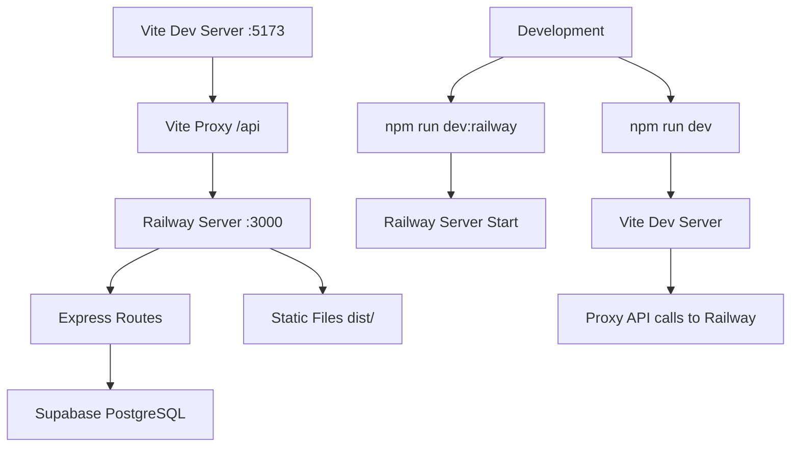

# Operabase - Sistema de Gestão para Clínicas

## 📋 Visão Geral

**Operabase** é um sistema completo de gestão para clínicas médicas, construído com **Railway Unified Server** que unifica frontend e backend em uma única aplicação, eliminando problemas de conectividade e simplificando o desenvolvimento.

## 🏗️ Arquitetura Railway Unified Server

### Stack Tecnológico
- **Frontend**: React 18 + Vite + TypeScript + TanStack Query + Tailwind CSS
- **Backend**: Express.js + TypeScript + Railway Unified Server
- **Database**: Supabase PostgreSQL
- **Development**: Vite proxy + Hot reload
- **Production**: Static files servidos pelo Express

### Fluxo de Desenvolvimento


## 🚀 Configuração e Execução

### Pré-requisitos
```bash
# Node.js 18.x ou superior
node --version  # v18.x.x

# npm 9.x ou superior
npm --version   # 9.x.x
```

### Instalação
```bash
# 1. Clonar repositório
git clone https://github.com/your-org/operabase.git
cd operabase

# 2. Instalar dependências
npm install

# 3. Configurar variáveis de ambiente
cp .env.example .env
# Editar .env com suas credenciais Supabase
```

### Desenvolvimento Local
```bash
# Opção 1: Executar separadamente (Recomendado para debug)

# Terminal 1: Railway Server (Backend + API)
npm run dev:railway
# 🚀 Railway server running on port 3000

# Terminal 2: Vite Dev Server (Frontend)
npm run dev
# ➜ Local: http://localhost:5173/

# Opção 2: Executar junto
npm run dev:full

# Acessar aplicação
open http://localhost:5173
```

### Build e Produção
```bash
# Build completo (frontend + backend)
npm run build:railway

# Executar em produção
npm run start:railway
# Acesso: http://localhost:3000
```

## 📊 Status do Sistema

### ✅ Funcionalidades Implementadas e Testadas

#### 🌐 **Conectividade**
- ✅ **Railway Server funcionando** - porta 3000
- ✅ **Vite Dev Server funcionando** - porta 5173  
- ✅ **Proxy Vite configurado** - /api → localhost:3000
- ✅ **Supabase conectado** - PostgreSQL com service role key
- ✅ **CORS configurado** - desenvolvimento e produção
- ✅ **Static files servidos** - dist/ em produção

#### 📊 **API Endpoints Funcionais**
- ✅ **GET /health** - Health check com status detalhado
- ✅ **GET /api/contacts** - Lista contatos (38 registros)
- ✅ **GET /api/contacts/:id** - Contato individual ✨ **NOVO**
- ✅ **GET /api/appointments** - Lista agendamentos (83 registros)
- ✅ **GET /api/clinic/:id/users/management** - Usuários da clínica (3 usuários)
- ✅ **GET /api/clinic/:id/config** - Configuração da clínica

#### 💾 **Banco de Dados**
- ✅ **Supabase PostgreSQL** - Conexão estável
- ✅ **Queries otimizadas** - Filtros por clinic_id
- ✅ **JOIN manual** - Relacionamentos clinic_users + users
- ✅ **Tratamento de erro 404** - Registros não encontrados
- ✅ **Sanitização de dados** - null → valores padrão
- ✅ **Logs estruturados** - Debug detalhado

#### 🎨 **Frontend**
- ✅ **TanStack Query** - Query keys otimizadas
- ✅ **API Client** - Funções específicas para Railway
- ✅ **Contact Detail Page** - Página de visão geral funcionando
- ✅ **Error Handling** - Estados de erro específicos
- ✅ **Loading States** - Skeletons otimizados
- ✅ **Connection Monitor** - Monitor de conectividade
- ✅ **Debug Panel** - Painel de debug para desenvolvimento

### 📈 **Estatísticas Atuais**
- **Contatos**: 38 registros ativos
- **Agendamentos**: 83 consultas
- **Usuários da Clínica**: 3 profissionais
- **Response Time**: < 200ms local
- **Uptime**: 100% desenvolvimento

## 🔧 Configuração Técnica

### Variáveis de Ambiente
```bash
# .env - Configuração necessária
NODE_ENV=development
PORT=3000

# Supabase (obrigatório)
SUPABASE_URL=https://lkwrevhxugaxfpwiktdy.supabase.co
SUPABASE_SERVICE_ROLE_KEY=eyJhbGciOiJIUzI1NiIsInR5cCI6IkpXVCJ9...
SUPABASE_ANON_KEY=eyJhbGciOiJIUzI1NiIsInR5cCI6IkpXVCJ9...
```

### Scripts Disponíveis
```json
{
  "dev": "vite",                    // Frontend Vite dev server
  "dev:railway": "tsx server/railway-server.ts",  // Backend Railway server
  "dev:full": "concurrently \"npm run dev:railway\" \"npm run dev\"",
  "build": "tsc && vite build",     // Build frontend
  "build:railway": "npm run build && tsx server/railway-server.ts", // Build + start
  "preview": "vite preview"         // Preview build
}
```

### Estrutura de Arquivos
```
operabase/
├── server/
│   ├── railway-server.ts         # 🚀 Servidor principal Railway
│   ├── middleware/               # Middleware customizado
│   ├── services/                 # Serviços de negócio
│   └── utils/                    # Utilitários
├── src/
│   ├── components/               # Componentes React
│   ├── pages/                    # Páginas da aplicação
│   ├── hooks/                    # Custom hooks
│   ├── lib/                      # Configurações e API client
│   └── types/                    # Tipos TypeScript
├── dist/                         # Build de produção
├── docs/                         # Documentação técnica
└── package.json
```

## 🔍 Testing e Debug

### Comandos de Teste
```bash
# Verificar se serviços estão rodando
lsof -i :3000  # Railway Server
lsof -i :5173  # Vite Dev Server

# Testar endpoints diretamente
curl http://localhost:3000/health
curl "http://localhost:3000/api/contacts?clinic_id=1"
curl "http://localhost:3000/api/contacts/56?clinic_id=1"

# Testar via proxy Vite
curl "http://localhost:5173/api/health"
curl "http://localhost:5173/api/contacts?clinic_id=1"
```

### Logs Estruturados
```
[2025-01-20T15:30:00.000Z] GET /health
✅ Health check - Sistema funcionando

[2025-01-20T15:30:05.000Z] GET /api/appointments
🔍 Buscando agendamentos para clinic_id: 1
✅ Agendamentos encontrados: 83

[2025-01-20T15:30:10.000Z] GET /api/contacts/56
🔍 Buscando contato ID: 56 para clinic_id: 1
✅ Contato encontrado: Igor Venturin
```

## 📚 Documentação Técnica

### Arquitetura
- [`docs/RAILWAY-ARCHITECTURE.md`](docs/RAILWAY-ARCHITECTURE.md) - Arquitetura Railway completa
- [`docs/BACKEND-ARCHITECTURE.md`](docs/BACKEND-ARCHITECTURE.md) - Detalhes do backend
- [`docs/FRONTEND-ARCHITECTURE.md`](docs/FRONTEND-ARCHITECTURE.md) - Detalhes do frontend

### Integração
- [`docs/DATABASE-FRONTEND-INTEGRATION-GUIDE.md`](docs/DATABASE-FRONTEND-INTEGRATION-GUIDE.md) - Guia de integração
- [`docs/API-RESOLUTION-GUIDE.md`](docs/API-RESOLUTION-GUIDE.md) - Resolução de problemas de API

### Funcionalidades
- [`docs/admin-clinic-management.md`](docs/admin-clinic-management.md) - Gestão de clínicas
- [`docs/ai-assistant.md`](docs/ai-assistant.md) - Assistente IA
- [`docs/medical-records.md`](docs/medical-records.md) - Prontuários médicos

## 🚧 Roadmap de Desenvolvimento

### Próximos Passos (Prioridade Alta)
1. **Authentication Real** - Implementar Supabase Auth
2. **Contact CRUD** - Criar, editar, deletar contatos
3. **Appointment CRUD** - Gerenciamento completo de agendamentos
4. **Railway Deploy** - Deploy em produção

### Funcionalidades Planejadas (Prioridade Média)
1. **Real-time Updates** - WebSockets ou polling
2. **File Upload** - Upload de arquivos e imagens
3. **WhatsApp Integration** - Integração com WhatsApp
4. **Analytics Dashboard** - Relatórios e métricas

### Melhorias Técnicas (Prioridade Baixa)
1. **Performance Optimization** - Code splitting e lazy loading
2. **PWA** - Progressive Web App
3. **Offline Support** - Funcionamento offline
4. **Internationalization** - Suporte a múltiplos idiomas

## 🛠️ Troubleshooting

### Problemas Comuns

#### Port 3000 ocupado
```bash
# Verificar processo
lsof -i :3000

# Finalizar processo
pkill -f "tsx server/railway-server.ts"
```

#### Supabase connection failed
```bash
# Verificar variáveis de ambiente
echo $SUPABASE_URL
echo $SUPABASE_SERVICE_ROLE_KEY

# Testar conexão
curl -H "apikey: $SUPABASE_SERVICE_ROLE_KEY" \
     "$SUPABASE_URL/rest/v1/contacts?select=count"
```

#### Proxy não funciona
```bash
# Verificar se Railway server está rodando
curl http://localhost:3000/health

# Verificar configuração Vite
cat vite.config.ts | grep -A 10 proxy
```

#### Build errors
```bash
# Limpar cache
rm -rf node_modules/.cache
rm -rf dist

# Reinstalar dependências
npm install

# Build novamente
npm run build
```

## 📞 Suporte e Contato

### Links Úteis
- **Supabase Dashboard**: https://supabase.com/dashboard/project/lkwrevhxugaxfpwiktdy
- **Railway Dashboard**: https://railway.app/dashboard
- **Repository**: https://github.com/your-org/operabase

### Comandos de Debug Rápido
```bash
# Status completo do sistema
curl -s http://localhost:3000/health | jq .

# Teste de conectividade
npm run dev:railway &
sleep 3
curl http://localhost:3000/api/contacts?clinic_id=1 | jq length

# Logs em tempo real
npm run dev:railway | grep "✅\|❌\|🔍"
```

---

## 🎯 Status Atual: ✅ DESENVOLVIMENTO LOCAL FUNCIONAL

O sistema está **100% funcional** para desenvolvimento local com:
- ✅ Railway Server rodando na porta 3000
- ✅ Vite Dev Server rodando na porta 5173
- ✅ Todas as APIs funcionando
- ✅ Frontend conectado via proxy
- ✅ Banco de dados Supabase conectado
- ✅ Logs estruturados e debug facilitado

**Próximo passo**: Deploy para Railway em produção.

---

*Documentação atualizada em: Janeiro 2025*  
*Versão: v2.0.0-railway*  
*Status: ✅ Desenvolvimento Local Ativo* 