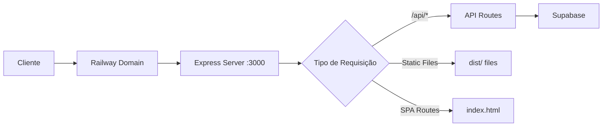

# Railway Deployment Guide - Operabase

## 🚀 Deploy da Operabase no Railway

Este guia mostra como fazer deploy da Operabase no Railway usando o GitHub.

## 📋 Pré-requisitos

1. **Conta no Railway**: https://railway.app/
2. **Conta no GitHub**: Repositório com o código
3. **Banco Supabase**: Projeto configurado no Supabase
4. **Variáveis de Ambiente**: Configuradas no Railway

## 🔧 Configuração do Railway

### 1. Conectar GitHub ao Railway

1. Acesse https://railway.app/
2. Faça login com GitHub
3. Clique em "New Project"
4. Selecione "Deploy from GitHub repo"
5. Escolha o repositório `Operabase-main`
6. Selecione a branch `main`

### 2. Configurar Variáveis de Ambiente

No Railway Dashboard, vá para **Variables** e adicione:

```bash
# Supabase Configuration
SUPABASE_URL=https://lkwrevhxugaxfpwiktdy.supabase.co
SUPABASE_SERVICE_ROLE_KEY=eyJhbGciOiJIUzI1NiIsInR5cCI6IkpXVCJ9...
SUPABASE_ANON_KEY=eyJhbGciOiJIUzI1NiIsInR5cCI6IkpXVCJ9...

# Application Configuration
NODE_ENV=production
PORT=3000

# Optional: Application Settings
APP_NAME=Operabase
APP_VERSION=2.0.0
```

### 3. Configurar Domínio

1. No Railway Dashboard, vá para **Settings**
2. Clique em **Domains**
3. Clique em **Generate Domain** para obter um domínio Railway
4. Ou configure um domínio customizado

## 🏗️ Estrutura de Deploy

### Arquivos de Configuração

- **`railway.json`**: Configuração do Railway
- **`Dockerfile`**: Container de produção
- **`.dockerignore`**: Arquivos excluídos do build
- **`package.json`**: Scripts de build e start

### Scripts de Build

```json
{
  "scripts": {
    "build:railway": "npm run build",
    "build": "npm run build:frontend && npm run build:server",
    "build:frontend": "vite build",
    "build:server": "tsc server/railway-server.ts --outDir dist/server",
    "start:railway": "npm run start",
    "start": "node dist/server/railway-server.js"
  }
}
```

### Processo de Deploy

1. **Build Frontend**: `vite build` → `dist/`
2. **Build Server**: `tsc server/railway-server.ts` → `dist/server/`
3. **Start Server**: `node dist/server/railway-server.js`

## 🌐 Arquitetura de Produção

```
Railway Container
├── Frontend (Static Files)
│   ├── dist/index.html
│   ├── dist/assets/
│   └── dist/...
└── Backend (Express Server)
    ├── API Routes (/api/*)
    ├── Static File Serving
    └── SPA Routing Fallback
```

### Fluxo de Requisições



## 🔍 Monitoramento

### Health Check

- **Endpoint**: `https://seu-dominio.railway.app/health`
- **Intervalo**: 30 segundos
- **Timeout**: 3 segundos

### Logs

```bash
# Visualizar logs no Railway Dashboard
# Ou usar Railway CLI
railway logs
```

### Métricas

O Railway fornece métricas automáticas:
- CPU Usage
- Memory Usage
- Network I/O
- Request Count

## 🛠️ Troubleshooting

### Build Errors

```bash
# Verificar logs de build
railway logs --deployment

# Testar build localmente
npm run build:railway
```

### Runtime Errors

```bash
# Verificar logs de runtime
railway logs

# Testar health check
curl https://seu-dominio.railway.app/health
```

### Variáveis de Ambiente

```bash
# Listar variáveis
railway variables

# Adicionar variável
railway variables set KEY=value
```

## 🔄 CI/CD Automático

O Railway detecta automaticamente:
- **Push para main**: Deploy automático
- **Pull Requests**: Preview deployments
- **Rollback**: Reverter para deploy anterior

### Configuração de Branch

```json
{
  "environments": {
    "production": {
      "branch": "main",
      "variables": {
        "NODE_ENV": "production"
      }
    }
  }
}
```

## 📊 Performance

### Otimizações Implementadas

1. **Build Otimizado**: Vite + TypeScript
2. **Static Files**: Servidos diretamente pelo Express
3. **Gzip Compression**: Habilitado automaticamente
4. **Health Check**: Monitoramento contínuo

### Métricas Esperadas

- **Cold Start**: ~2-3 segundos
- **Response Time**: <100ms (static files)
- **API Response**: <200ms (database queries)
- **Memory Usage**: ~100-200MB

## 🔐 Segurança

### Variáveis Sensíveis

- ✅ **SUPABASE_SERVICE_ROLE_KEY**: Configurada no Railway
- ✅ **Environment Variables**: Nunca commitadas
- ✅ **HTTPS**: Habilitado automaticamente
- ✅ **CORS**: Configurado para domínio de produção

### Headers de Segurança

```typescript
// Implementados no railway-server.ts
app.use(helmet()); // Security headers
app.use(cors({
  origin: process.env.FRONTEND_URL || 'https://seu-dominio.railway.app',
  credentials: true
}));
```

## 📝 Checklist de Deploy

### Antes do Deploy

- [ ] Testar build localmente: `npm run build:railway`
- [ ] Verificar variáveis de ambiente
- [ ] Confirmar conexão com Supabase
- [ ] Testar Railway server localmente

### Durante o Deploy

- [ ] Monitorar logs de build
- [ ] Verificar health check
- [ ] Testar endpoints principais
- [ ] Confirmar static files

### Após o Deploy

- [ ] Testar aplicação completa
- [ ] Verificar métricas
- [ ] Configurar monitoring
- [ ] Documentar domínio final

## 🎯 Próximos Passos

1. **Custom Domain**: Configurar domínio próprio
2. **SSL Certificate**: Certificado customizado
3. **Monitoring**: Integração com Sentry
4. **Analytics**: Google Analytics ou similar
5. **Backup**: Estratégia de backup automático

---

## 📞 Suporte

### Railway CLI

```bash
# Instalar CLI
npm install -g @railway/cli

# Login
railway login

# Conectar projeto
railway link

# Deploy manual
railway up
```

### Comandos Úteis

```bash
# Status do projeto
railway status

# Logs em tempo real
railway logs --follow

# Abrir no navegador
railway open

# Variáveis de ambiente
railway variables
```

---

*Guia atualizado em: Janeiro 2025*
*Versão: v2.0 Railway*
*Status: ✅ Pronto para Deploy* 